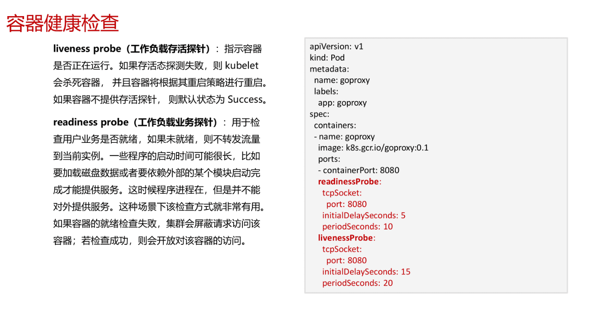
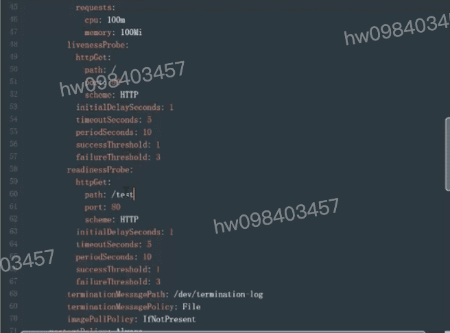

## 容器健康检查
  - liveness probe (工作负载存活探针)
  - readiness probe (工作负载业务探针)

## 探针检查机制 k8s支持如下三种探测机制
  - HTTP GET: 2xx 3xx 
  - TCP Socket:
  - Exec: 命令退出的状态码

[参考](https://education.huaweicloud.com/courses/course-v1:HuaweiX+CBUCNXI048+Self-paced/courseware/200a2e26f50a492fa016ac65f4cf915a/7ef1d56d910e46eca6db83710953dd32/)

