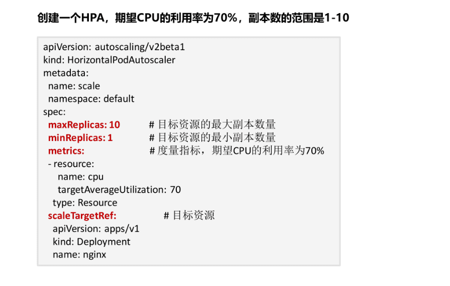

## AutoScaler 节点伸缩原理解析
  - 简称CA

## HPA(工作负载伸缩原理) `首先要能感知到各种运行数据` `CPU` `内存`
  - Prometheus: `自定义指标`
  - Metrics Server是: `CPU` `内存`

## 页面配置,完成一次实验  `前提是先安装插件`

[参考](https://education.huaweicloud.com/courses/course-v1:HuaweiX+CBUCNXI048+Self-paced/courseware/200a2e26f50a492fa016ac65f4cf915a/5d09de430320420c967f4600fa35ddfe/)

