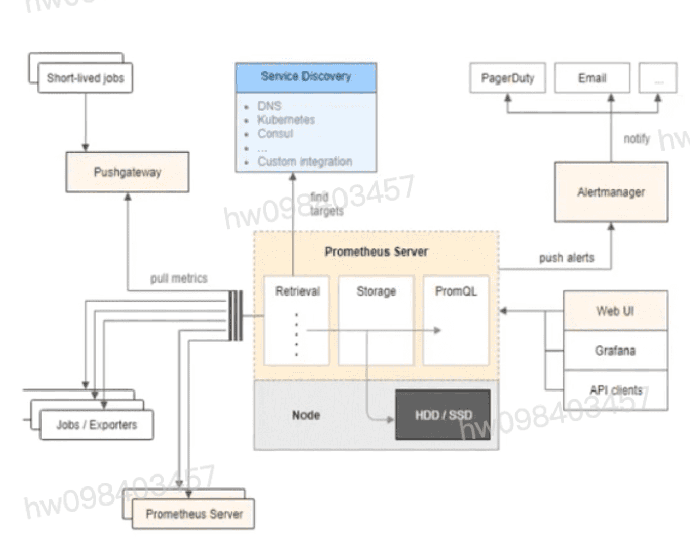
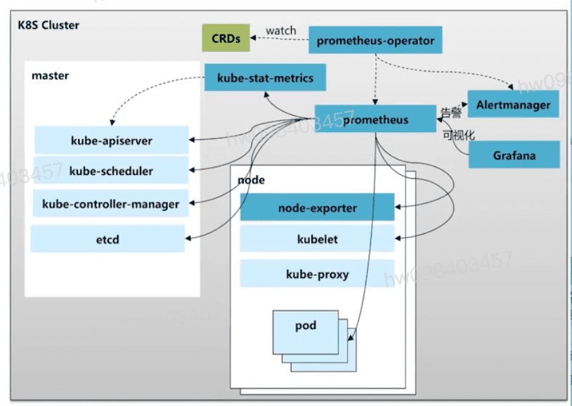

## 云原生应用特点
  - **应用架构**
    - 从单体应用向微服务过渡
    - 应用架构过渡为松耦合系统
    - 应用版本迭代更快,周期更短
  - **基础设施层**
    - 容器化,应用自身快,轻,微
    - k8s成为运行容器的默认平台
    - iaas, pass 平台底层来承载k8s平台
  - **软件生命周期**
    - 服务通过devops流水线持续布署
    - 服务变更低成本和低风险
    - 呈现高频率和全自动变更

## k8s与云原生应用监控挑战
  - **k8s架构复杂性:** k8s架构包括控制节点和工作节点,各自包含一组相互通信的组件,比如kube-apiserver,etcd,kubelet等
  - **微服务架构:** 应用从单体到微服务架构的转变,导致应用数量激增,相互依赖关系复杂,出现了问题之后,如何快速定位到发生问题的根本原因.
  - **动态性:** 应用的迭代更新更加便捷迅速,pod,service等资源随时可能会起v说或重建,需要监控系统具备动态发现k8s资源的能力.
  - **成本:** 微服务的规模和动态性使得监控数据规模和收集的成本大幅度提高

## 应对挑战,社区引入了**可观测性**这一理念,可观测性系统主要基于Metrics,Traces,Logs三大数据类型构建.
  - **Metrics:** 收集并存储海量指标,通过指标阀值等手段实现告警通知,从而告知有没有问题发生
  - **Traces:** 通过告警指标发现问题后,依据调用追踪分析,进一步明确是什么问题.
  - **logs:** 明确了问题发生的对象或者位置后,通过日志分析等手段实现为什么问题会发生,即找到问题的根因
  - 总结: 围绕着这三种数据类型,开源社区构建了多种多样的开源产品,像Prometheus,Cortex,node-problem-detector,Fluentd,ELK,Loki,Jaeger等.

## 指标监控与Prometheus
  - **指标监控**
    - **指标(Metrics)** 是在许多个连续的时间周期度量的KPI数值.比如我们常常谈到的一个应用在过去十分钟,半小时内的cpu,内存占用率等
    - **系统指标:** `cpu使用率` `磁盘使用率` `网络带宽情况`
    - **应用指标:** `QPS` `出错率` `平均延时`
    - **业务指标:** `用户会话` `订单数量` `营业额`
  - **Prometheus简介**
    - 2016年5月继k8s之后成为第二个正式加入CNCF基金会的项目
    - **Prometheus已经成为云原生监控领域的事实标准**

## Prometheus架构 及主要特点
  - 自定义多维数据模型(时序列数据由metric名和一组key/Value标签组成)
  - 非常高效的存储,平均一个采样数据占用~3.5Bytes左右,320万的时间序列,每30秒采样,保存60天,消耗磁盘大概228G
  - 在多维度上灵活且强大的查询语言(promQL),支持sum,rate,max,min等大量的计算函数
  - 不依赖分布式存储,支持单节点工作
  - 基于pull方式采集时序数据
  - 可以通过push gateway进行时序列数据推送(pushing)
  - 可以通过服务发现或者静态配置去获取要采集的target
  - 社区支持大量第三方exporter和client库 `grafana`

## 基于prometheus-operator集群监控架构
  - **简言之,Prometheus Operator能够帮助用户自动化的创建以及管理Prometheus Server以及相应的配置**
  - **Prometheus-operator:** 本质是一组CRD和controller的实现,Prometheus operator提供如下几类CRD:
    - **Prometheus:** 声明式创建和管理Promethus Server实例
    - **ServiceMonitor:** 负责声明式的管理监控配置
    - **PrometheusRule:** 负责声明式的管理告警配置
    - **Altermanager:** 声明式的创建和管理Alertmanager实例
    - **架构图如下**

## k8s集群监控指标解析
  - 容器基础资源指标 `cadvisor metrics`
    - `cpu` `mem` `文件系统使用率` `容器网络/磁盘IO` `错误率`
    - `container_cpu_usage_seconds_total`
  - k8s资源指标 `kube-stats-metrics`
    - `工作负载状态` `pod重启次数` 
    - `kube_pod_container_status_restarts_total`
  - k8s服务组件指标 `服务组件metrics接口`
    - `apiserver访问错误率` `etcd主备情况` `coredns请求延迟`
    - `apiserver_request_total`
    - `coredns_dns_request_count_total`
  - pod中的业务埋点 `POD的metrics接口`
    - `依据业务场景自定义指标` `订单数` `交易失败次数`

## 基于Grafana指标可视化
  - sun by (container_memory_working_set_bytes(namespace="$namespace",image!="",container=~"$container",container!="POD",pod="$pod"))

## 集群事件监控 `k8s的事件Event` 与实践架构
  - k8s的Event事件是一种资源对象,用于展示集群内发生的情况,k8s系统中的各个组件会将运行时发生的各种事件上报给apiserver. 可以通过kubectl get event 或者 kubectl describe pod podName命令显示事件,查看k8s集群中发生了哪些事件  
  - apiserver会将Event事件存在etcd集群中,为了避免磁盘空间被填满,帮强制执行保留策略:在最后一次事件发生后删除1小时前发生的事件
  - 架构 `NodeProblemDetector`
    - `ES` `Kafka` `Webhook/HTTp`
 
## NodeProblemDetector(NPD)
  - 节点问题检查器(NodeProblemDetector(NPD) 是一个守护程序,用于监视和报告节点的健康状况 

## 集群日志监控 `fluentd + ELK` 日志在k8s里面主要分为四个大的场景
  - **主机内核的日志:** 比如文件系统异常,kernel panic,或者OOM日志
  - **Runtime日志:** docker的日志排查类似像Pod Hang这一系列的问题
  - **核心组件日志:** k8s里面核心组件包含 etcd,apiserver,kube-scheduler,controller-manager,kubelet等等一系列的组件,
  - **应用日志:** 可以通过应用的日志查看业务层的一个状态. 比如说可以看业务层有没有500的请求?有没有一些panic?有没有一些异常的错误访问?那这些其实都可以通过应用日志来进行查看
  - **解决方案:** `Elasticsearch`  `Kibana`

## 拓扑与调用链
  - 将单体应用拆成多个微服务后,如何监控服务之间的依赖关系和调用链,以判断应用在哪个服务环节出了问题,哪些地方可以优化?
  - **分布式追踪(Distributed Tracing)**
  - CNCF提出了分布式追踪的标准 **OpenTracing** , 它提供用户厂商中立的API,并提供Go,Java等等多种语言库
  

[参考](https://education.huaweicloud.com/courses/course-v1:HuaweiX+CBUCNXI049+Self-paced/courseware/b3464e0101d24fc1ab00e3c132a0c785/7b88027c23be450f815bd770a8cf5053/)

