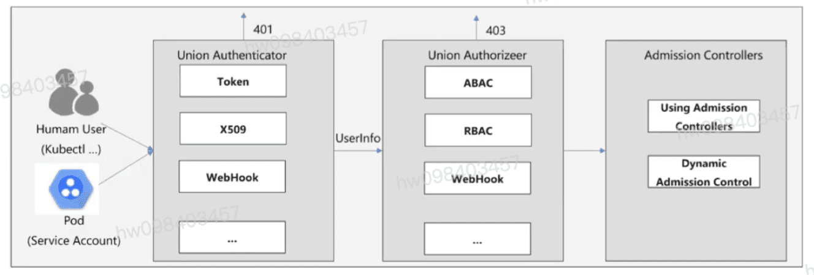
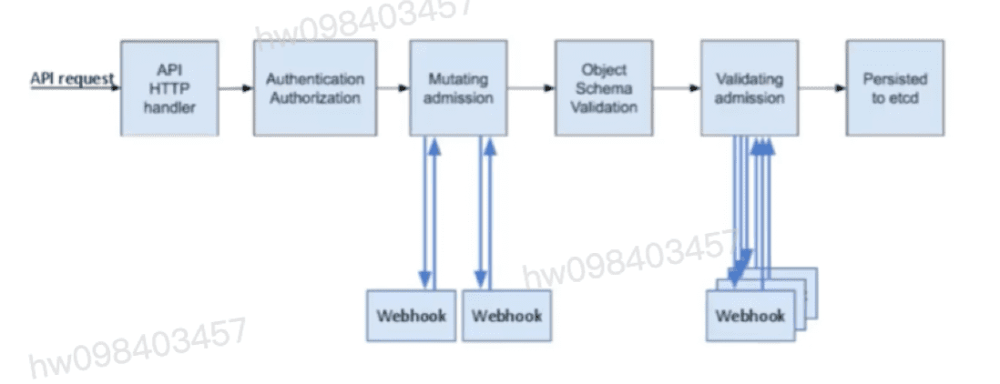

## k8s准入控制及集群认证与鉴权机制
  - k8s自身并没有用户管理能力,无法像操作pod一样,通过api的方式创建/删除一个用户实例,也无法在etcd中找到用户对应的存储对象
  - 在k8s的访问控制流程中,用户模型是通过请求方的访问控制凭证(kubectl使用的kube-config中的证书,pod中引入的ServerAccount)产生

## 安全全景图
  - 部署态的安全机制
    - 认证
    - 鉴权
    - Admission(准入控制)
    - Pod SecurityContext
  - 运行态的安全控制
    - Network policy

## k8s API 访问控制
  - 认证
    - 集群创建脚本或者集群管理员配置API服务器,使之运行一个或多个身份认证组件
    - 认证步骤输入整个HTTP请求,主要检查头部或客户端证书
    - 认证模块包含客户端证书,密码,普通令牌,引导令牌和JSON Web 令牌(JWT,用于服务账户), API server依次尝试每个验证模块,查到期中一个成功
    - 如果请求认证不通过,服务器以HTTP状态码401拒绝该请求
  - 鉴权
    - 认证通过后,可以识别具体客户信息,并根据用户和请求信息进行鉴权,k8s鉴权要求使用公共rest属性与现有的组织范围或云提供商范围的访问控制系统进行交互.
    - 请求必须包含请求者的用户名,请求的行为以及受该操作影响的对象.

## k8s支持多种鉴权模块,例如ABAC模式,RBAC模式和Webhook模式等

## k8s Addmison Controller
  - Addmison Controller实现了对于k8s集群的准入控制. 如下图 Addmison Controller以插件的形式内置王老师k8s APIServer,在APIServer对请求的处理链路中发挥作用

[参考](https://education.huaweicloud.com/courses/course-v1:HuaweiX+CBUCNXI050+Self-paced/courseware/51eb69d01b414a0e985cdf4c862ccdd9/da906e171c404b4589431929a12aff31/)

