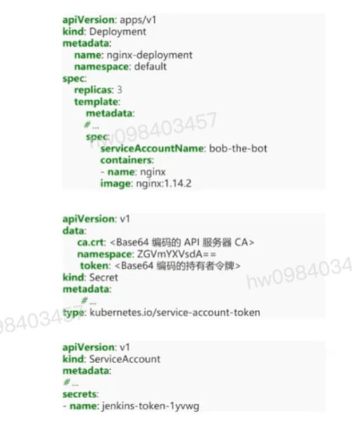
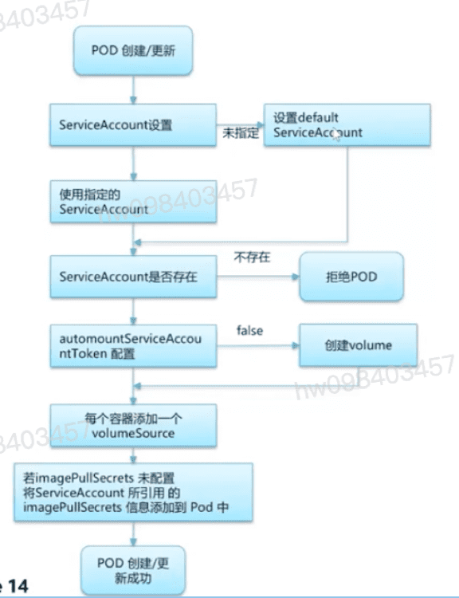

## 认证 Authentication `服务帐号` `普通用户`
  - k8s仍然能够提供由集群的证书机构签名的合法证书的通过身份认证.基于这样的配置,k8s使用证书中的'Subject'的通用名称(Common Name)字段 (例如:"/CN=bob")来确定用户名.接下来,基于角色访问控制(RBAC)子系统会确定用户是否有权针对某资源执行特定的操作
  - Service Account是k8s API所管理的用户.它们被绑定到特定的名字空间.自动创建,或者通过API调用创建.服务账号与一组以Secret保存的凭据相关,这些凭据会被挂载到Pod中,从而允许集群内的进程访问k8s API.

## 有如下的认证方式
  - X509 client certs
    - 客户端证书认证,可以api server配置 --client-ca-file证书启用
  - Static Token File
    - 静态Token认证
  - Bootstrap Tokens
    - 为了支持平滑地启动引导新的集群,k8s包含了一种动态管理的持有者令牌类型,API server配置 --enable-boostrap-token-auth
  - OpenId Connect Tokens
    - 基于OAuth2的认证方式,对OAuth2的主要扩充体现在有一个附加字段会和访问令牌一起返回,这一字段称作ID Token(ID令牌)

## service account样例
  - 持有者令牌会挂载到Pod中可预知的位置,允许集群内进程与API服务器通信.服务账号也可以使用Pod规约的serviceAccountNmame字段显示地关联到pod上
    - ca.crt
    - Namespace
    - token
    

## Tokencontroller
  - 监测 ServiceAccount的创建并创建相应的Secret以允许访问API
  - 监测ServiceAccount的删除并删除所有相应的Secret
  - list,Watch k8s apiserver对于命名空间的创建,删除;在新创建的名称空间下创建一个名为"default"的Service account

## ServiceAccount Admisson Controller
  - 当Pod被创建或更新时,它会同步地修改Pod. 当Pod被创建或更新时它会进行以下操作
  - **设置ServiceAccount**: 如果该Pod没有指定,则设置default ServiceAccount
  - **检验指定ServiceAccount 是否存在** 否则拒绝该Pod
  - **自动挂卷选项** 若automountServiceAccountToken 都为设置为false,使用已有,否则为Pod创建一个volume
  - **创建volumeSource挂载目录** 如果前一步中为服务账号令牌创建了卷,则为Pod中的每个容器添加一个volumeSource,挂载在其 /var/run/secrets/kubernetes.io/serviceaccount 目录下
  - **设置imagePullSecrets** 如果Pod不包含imagePullSecrets设置,将ServiceAccount所引用的服务账号中的imagePullSecrets信息添加到Pod中

## k8s认证流程源码分析
  - k8s.io/apiserver/pkg/server/config.go
    - DefaultBuildHandlerChain函数开始处理请求中的认证逻辑
    - DefaultBuildHandlerChain中包含了多种filter(如认证,链接数检验,RBAC权限检验等) **WithAuthentication**

[参考](https://education.huaweicloud.com/courses/course-v1:HuaweiX+CBUCNXI050+Self-paced/courseware/51eb69d01b414a0e985cdf4c862ccdd9/da5daa41fc3540f5aae339e7e44aabbb/)

