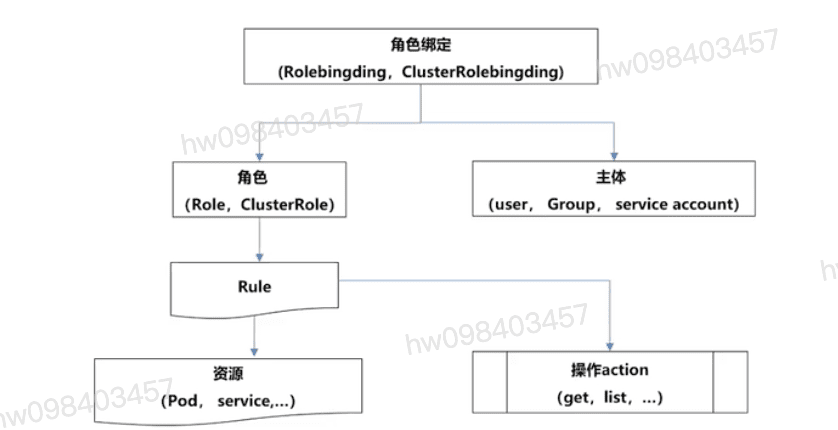
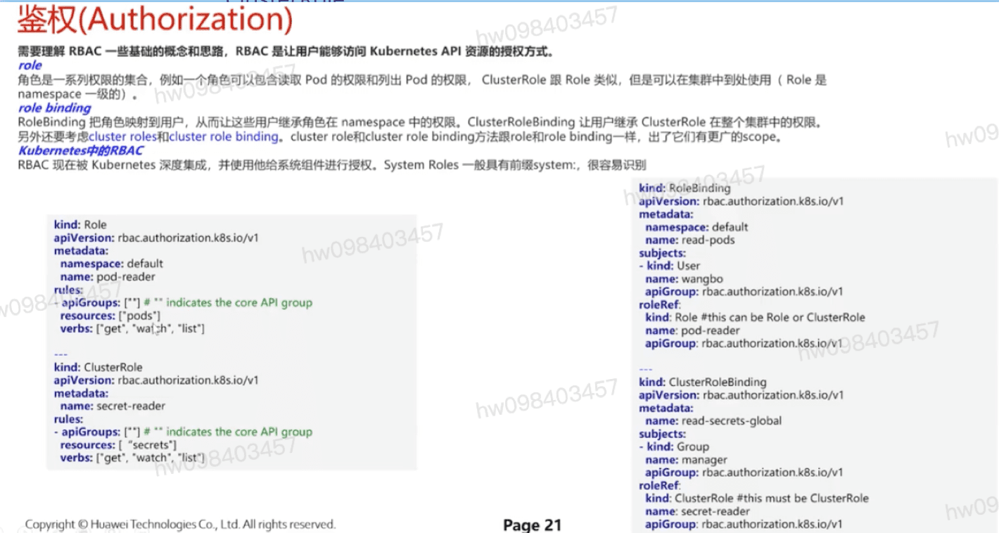
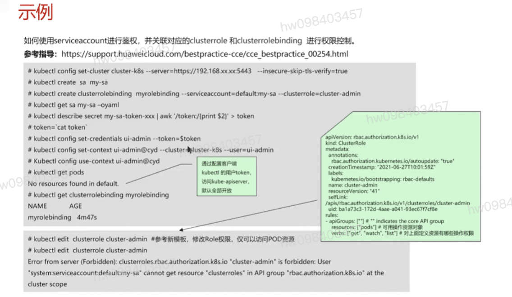

## 鉴权(Authorization)
  - **Node:**
  - **ABAC** 基于属性的访问控制
  - **RBAC** 基于角色的访问控制
    - **要启用RBAC,要使用--authorization-mode=RBAC启动API服务器**

## **RBAC** 
  - **定义角色** `Role` `ClusterRole`  **主体** `user` `Group` `service account`
  - **绑定角色**  `Rolebingding` `ClusterRolebingding`
  - **资源** `Pod` `service`
  - **操作** `get` `list`

## Role和ClusterRole 命名空间及权限详解
  - Role是只作用于命名空间级别,用于定义命名空间内资源权限集合
  - ClusterRole用于集群级别的资源权限集合,它们都是标准的API资源类型
  - 一般来说,ClusterRole的许可授权作用于整个集群,因此常用于控制Role无法生效的资源类型,这包括集群级别的资源(如:Nodes),非资源类型的端点(如/healthz)和作用于所有命名空间的资源(例如跨命名空间获取任何资源的权限)

## RoleBinding和ClusterRoleBinding
  - RoleBinding用于将Role上的许可权限绑定到一个或者一组用户之上,它隶属于且仅能作用于一个命名空间,绑定时,可以引用同一名称中的Role,也可以引用集群级别的ClusterRole
  - ClusterRoleBinding把ClusterRole中定义的许可权限绑定在一个或一组用户之上,它仅可以引用集群级别的ClusterRole

## 示例Role,ClusterRole

## 示例使用serviceaccount进行鉴权

[参考](https://education.huaweicloud.com/courses/course-v1:HuaweiX+CBUCNXI050+Self-paced/courseware/51eb69d01b414a0e985cdf4c862ccdd9/1fc8f1f82bf2480493b213d1e392e74a/)

1.1 K8S应用模板的使用场景介绍
1.2 Helmchart模板机制详解
1.3 Operator机制详解
1.4 课程材料
1.5 随堂测试

