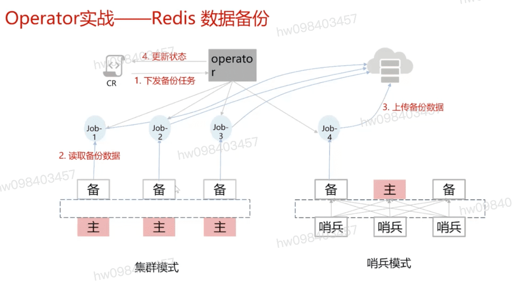

## Operator机制详解
  - 扩展k8s API,定义应用
    - /apis/{Group}/{Version}/namespaces/{namespace}/{Kind}/${name}
  - **k8s Controller机制**

## Operator特定于业务,以Redis集群拓扑
  -   备   主   备
    - 哨兵 哨兵 哨兵
  -   主 主 主
    - 备 备 备

## Operator特定于业务,以Redis扩容与存量数据迁移

## Operator特定于业务,以Redis备份

## Operator自身管理  `Operator Framework` 关键组件和概念
  - Operator Lifecycle Manager: 负责管理具体应用Operator的生命周期
  - 应用业务Operator:

[参考](https://education.huaweicloud.com/courses/course-v1:HuaweiX+CBUCNXI051+Self-paced/courseware/cf547353b7dc425fadd6f022f4d225e4/63cf510f88804e3d8b8d54897c3dd96e/)

1.1 Istio整体架构
1.2 透明的Sidecar原理
1.3 Istio基本功能实现原理
1.4 课程材料
1.5 随堂测试
Istio整体架构

