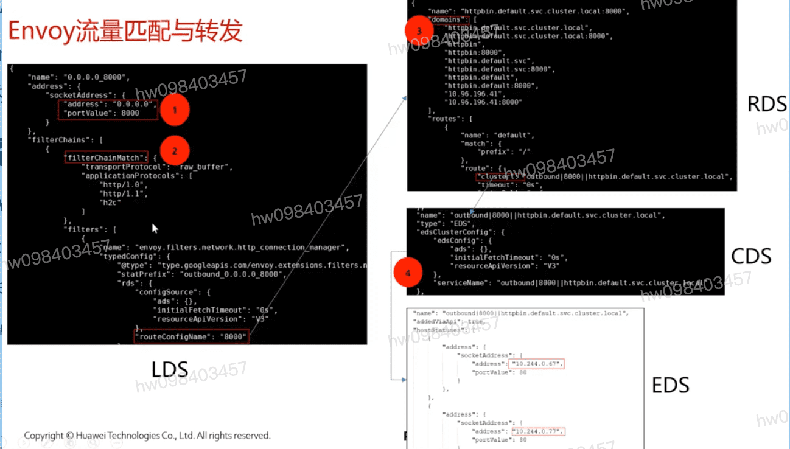

## Sidecar基本介绍
  - Sidecar自动注入,由Sidecar Injector负责,支持按照Namespace以及按照应用注入
  - 业务代码无感知Sidecar的存在
  - Sidecar负责拦截应用的流量,并且提供流量治理,安全,监控 `iptables`

## Sidecar流量拦截 **iptables chain**
  - InitContainer或者Istio-CNI设置iptables规则
  - 流量拦截的流程

## Envoy流量代理流程
  - **Listener Match** **FilterChain Match** **Route Match** **Load balancing**
  - LDS: istioctl pc listener [podname]
  - RDS: route
  - CDS: cluster
  - EDS: endpoint

## Envoy流量匹配与转发示例

[参考](https://education.huaweicloud.com/courses/course-v1:HuaweiX+CBUCNXI052+Self-paced/courseware/2196b207c84945a6b54e834897ee0828/5c03600b50b241e5aba9afb9d1560818/)

