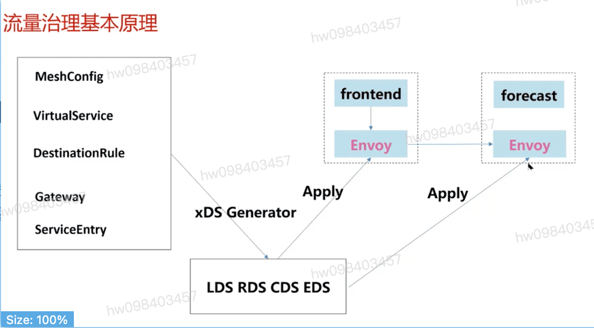
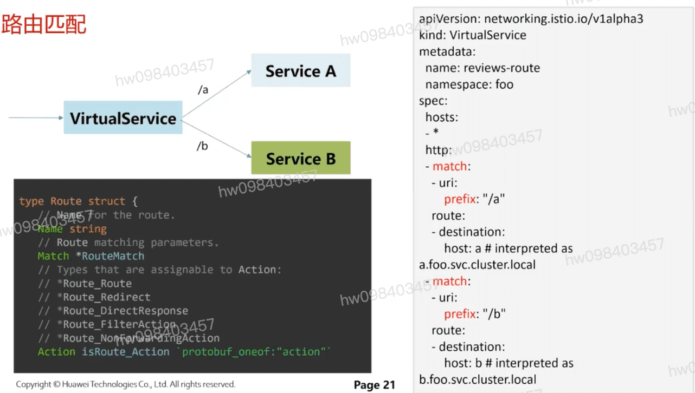
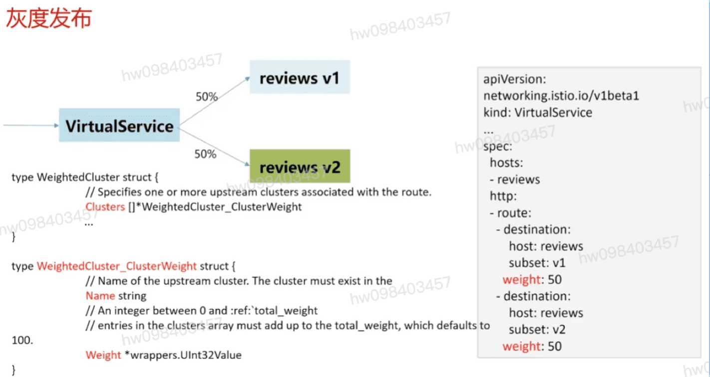
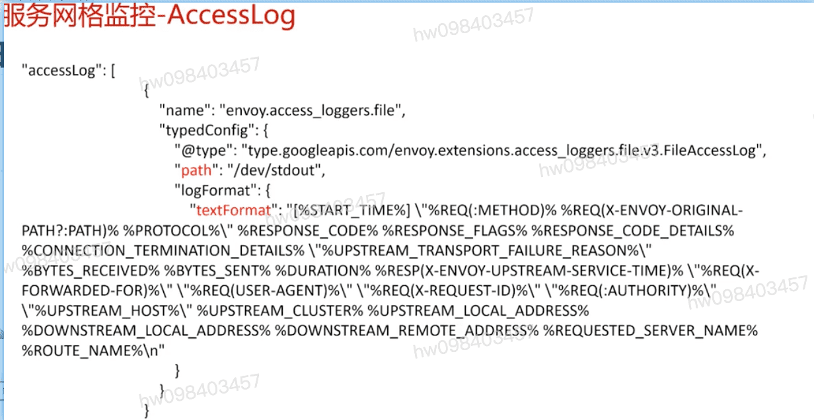

## 流量治理ApI
  - ServiceEntry `定义k8s集群外部服务,提供非k8s服务发现或者跨集群的服务发现`
  - VirtualService `定义一些路由匹配,灰度,故障注入等功能`
  - DestinationRule `提供目标服务的负载均衡策略以及连接管理,熔断等策略`
  - Gateway  `为服务网络边缘提供基本的流量转发策略`

## api与 xDS Generator的关系

## 服务发现

## 路由匹配示例

## 灰度发布示例

## Istio以非侵入的方式提供了以下遥测类型:
  - Metrics  `服务网络监控`
  - Distributed Traces `调用链拓扑功能` `在应用程序加入一个id`
    - 包含一个或者多个Span,Span表示一个逻辑单元,拥有起止时间并且包含Metadata,每个Span又包含:
  - Access Logs

[参考](https://education.huaweicloud.com/courses/course-v1:HuaweiX+CBUCNXI052+Self-paced/courseware/2196b207c84945a6b54e834897ee0828/5bf8b9f460e946c09bd1adb6b39f34eb/)

1.1 服务网格数据面Envoy介绍
1.2 Envoy原理及总体架构
1.3 Envoy启动配置及xDS
1.4 Envoy网络及线程模型、过滤器架构、HTTP请求流程
1.5 Envoy问题分析方法
1.6 课程材料
1.7 随堂测试
服务网格数据面Envoy介绍

