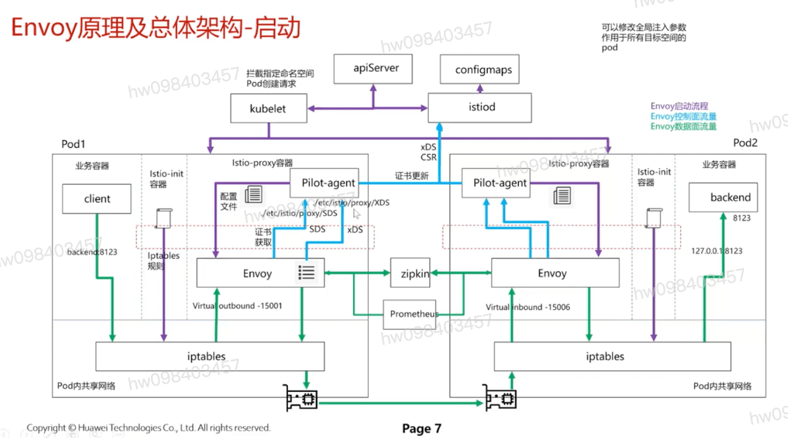
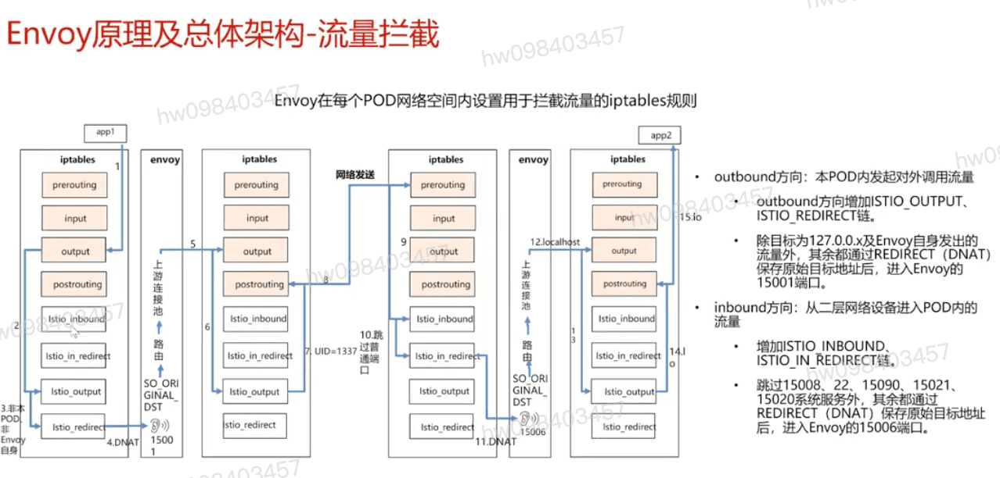

## 总体架构,启动

## 总体架构-说明

- 启动阶段
  - iptables规则
- 控制面通信
  - 证书下发
- 数据面通信
  - virtualInbound
  - virtualOutbound

## 流量拦截 iptable流量

[参考](https://education.huaweicloud.com/courses/course-v1:HuaweiX+CBUCNXI053+Self-paced/courseware/b56e7d61ad3e4b978fec062f752098ac/d298484db5204b1fb04140ce6a2d8791/)