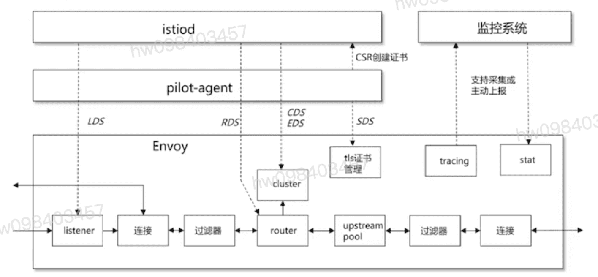
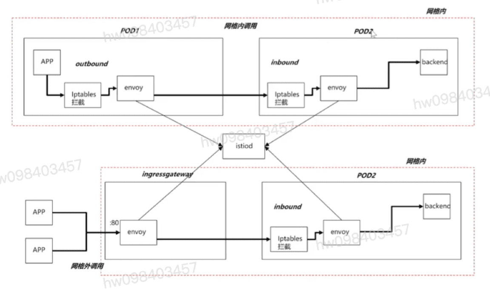
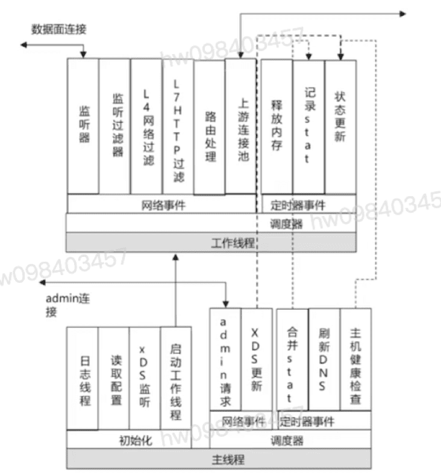

## Envoy启动配置及xDS
  - LDS 监听器配置
  - RDS 路由配置
  - CDS 上游cluster配置
  - EDS 上游cluster endpointer配置
  - SDS 安全及证书配置

## 实操Envoy启动配置及xDS-cont' 
  - 分为static_resources及dynamic_resources两种配置
  - 两种方式查看Envoy配置
    - pilot-agent: 访问Envoy 15000端口,指定url获取
      - kubectl exec -it $podname -c istio-proxy --pilot-ageent request GET /config_dump > config.json
    - istioctl:需要根据istio不同版本进行下载
      - istioctl pc listener $Podname #LDS
      - istioctl pc route $Podname #RDS
      - istioctl pc cluster $Podname #CDS
      - istioctl pc endpoint $Podname #EDS
      - istioctl pc secret $Podname #SDS

## Envoy常用部署方式

- 网格内部调用,通过自动注入到网络内的iptables规则进行拦截
- 默认为2个工作线程
- 默认最大上游连接数1024,最大挂起等待请求数1024
- 外部请求通过直接访问Ingressgateway网关端口进入网络
- Ingressgateway为Envoy相同二进制,不做iptables规则注入,作为外网客户端网络内代理
- Ingressgateway不设置工作线程数限制并且最大上游连接及最大挂起等待请求数请求数默认值不做限制

## Envoy网络及线程模型

- 分为Envoy主线程及worker线程
- 主线程
  - 负责初始化Envoy并读取解析配置文件
  - 启动gRPC监听器,并启动xDS变化监听
  - 启动日志写入线程,每个目标日志文件有独立线程负责输出
  - 启动admin RESTful监听,处理运行状态输出,prometheus收集等请求
  - 定期将工作线程内监控数据stat进行合并
  - 定期刷新DNS信息,加速域名解析
  - 目标cluster内主机列表健康状态判断
- worker线程
  - 通过启动配置参数concurrency指定,不支持动态调整
  - 启动Virtualoutbound/virtualinbound网络监听,每个工作线程都对此监听端口进行监听.由内核随机挑选监听线程处理新连接
  - 进行连接负载均衡处理后,选择最终的业务监听器处理新连接
  - 之后对于此连接的所有处理都在此线程进行,包括下游数据集解码,路由选择,上游数据编码发送等
  - 同时此工作线程还要处理定期观测信息与主线程同步(通过异步加回调),线程内配置及集群管理器状态更新等工作
  - 请求完成后延迟释放内存,解决本次事件处理中回调所引用对象可以被安全访问.并在下次事件处理中安全删除

[参考](https://education.huaweicloud.com/courses/course-v1:HuaweiX+CBUCNXI053+Self-paced/courseware/b56e7d61ad3e4b978fec062f752098ac/d27e0fa2855144e686968c48511a49f8/)

Istio流量治理与监控管理深度剖析
1.1 Istio流量治理基本介绍
1.2 Istio流量治理深度剖析

1.3 Istio监控深度剖析

1.4 课程材料

1.5 随堂测试

Istio流量治理基本介绍

