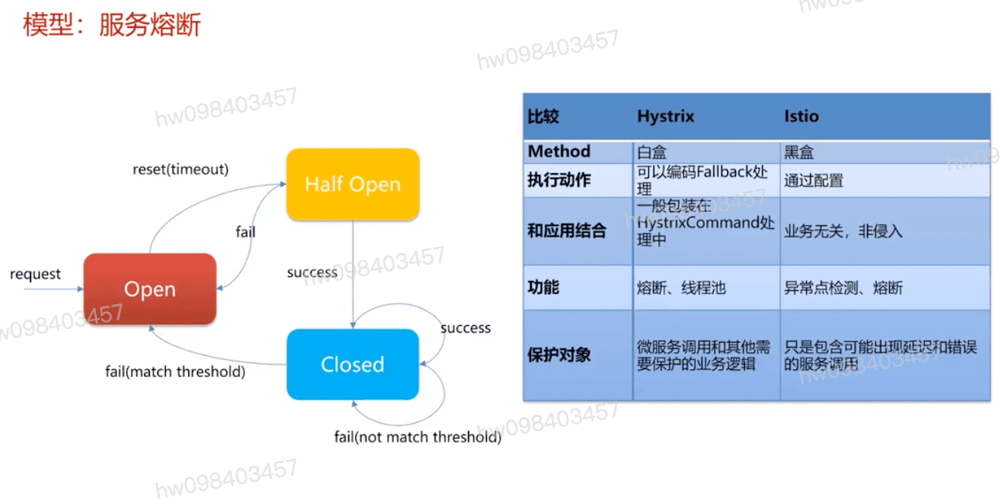

## 微服务架构业务解耦的同时带来了极大的复杂度
- 服务发现
- 埋点
- 特定语言的框架(微服务框架) SDK

## 基于网络的服务治理

- Istio基于k8s不需要做服务发现

- 熔断状态 , 半熔断状态 
- 故障隔离与恢复

[参考](https://education.huaweicloud.com/courses/course-v1:HuaweiX+CBUCNXI055+Self-paced/courseware/511f6f06d97d4aaf9b90445dca5800d1/bde6103a57ff44cebbae764080464053/)

1.1 微服务的概念和原理
1.2 传统微服务框架的问题和基于服务网格的解决方案
1.3 传统微服务框架在服务网格中集成的实践详情
