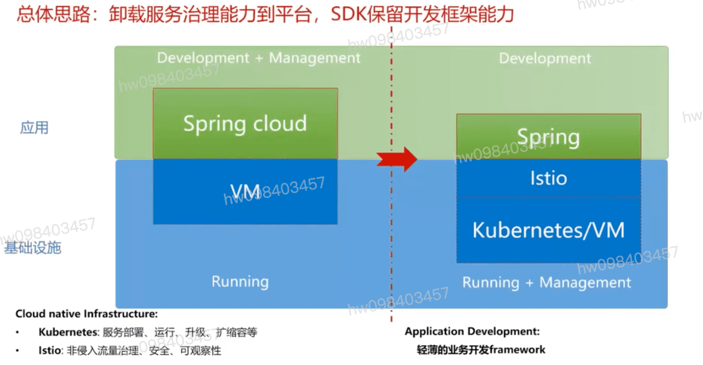
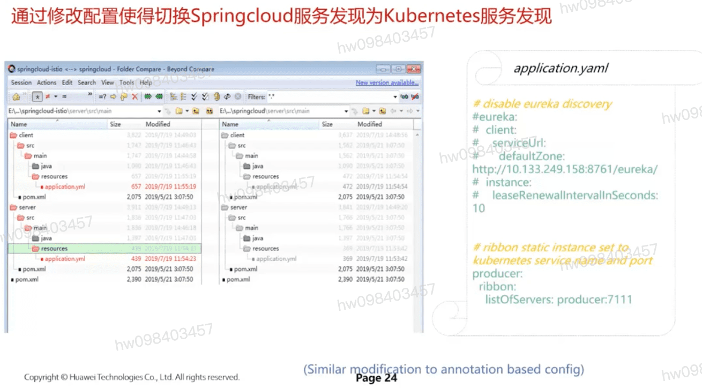
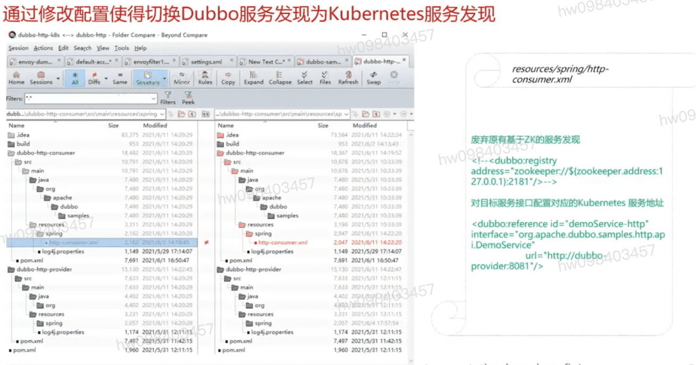
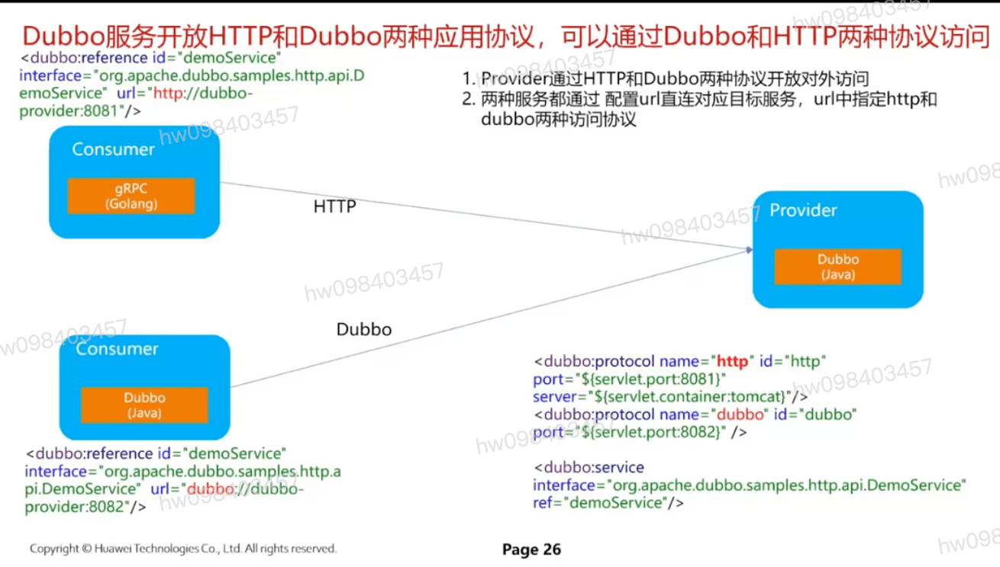
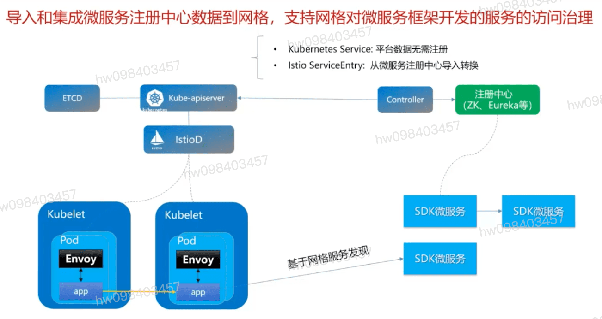
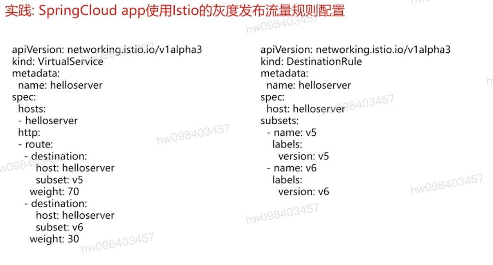
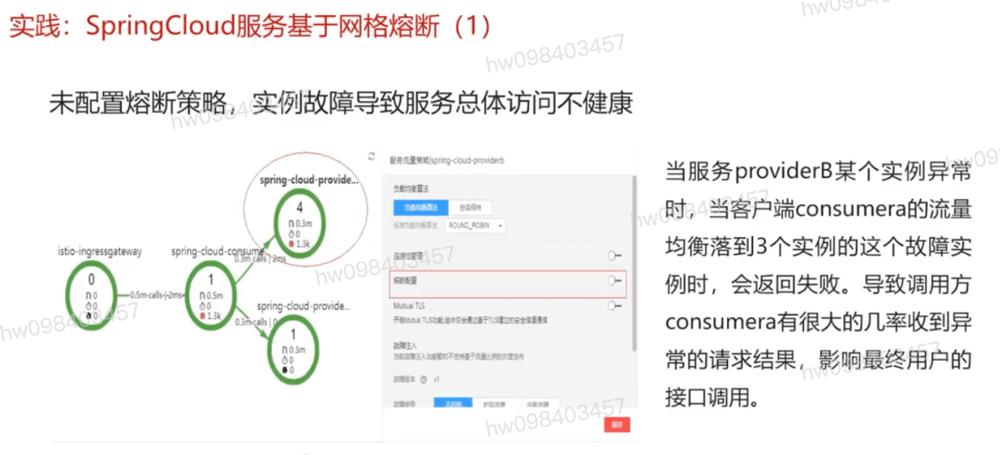
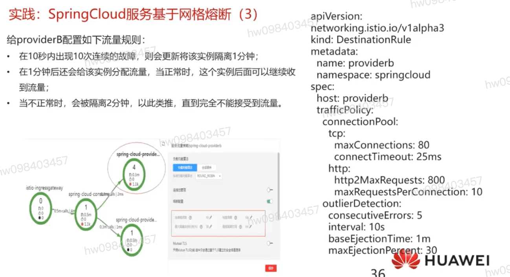

## 云产商的商业模型

## 实施工程师,把应用微服务化与k8s结合,用户与客户

- Springcloud

- Dubbo

  

- etcd,k8s,istio 顶层视图

- 实践 SpringCloud的一个配置(流量分配)

- 实践k8s Istio 基于网络熔断

## Istio流量规则配置实例

[参考](https://education.huaweicloud.com/courses/course-v1:HuaweiX+CBUCNXI055+Self-paced/courseware/511f6f06d97d4aaf9b90445dca5800d1/c08eb6fa0dd14a34bd617c6beb63a923/)

1.1 微服务的概念和原理
1.2 传统微服务框架的问题和基于服务网格的解决方案
1.3 传统微服务框架在服务网格中集成的实践详情
