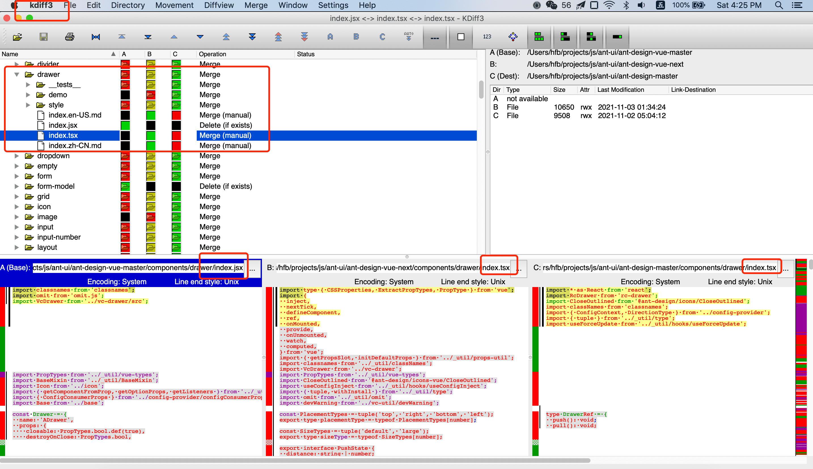

从零开始antd源码(ant-design组件库分析)


* 使用jsx写的组件库(vue,react)
* 项目路径
  * and-design-vue-master: vue2组件库  /Users/hfb/projects/js/ant-ui/ant-design-vue-master
  * ant-design-vue-next:vue3组件库  /Users/hfb/projects/js/ant-ui/ant-design-vue-next
  * ant-design-master: react组件库  /Users/hfb/projects/js/ant-ui/ant-design-master
  * ant-design-vue-pro-master:vue2开箱即用项目 /Users/hfb/projects/js/ant-ui/ant-design-vue-pro-master

* 按需加载打包使用的是gulp (开发模式是用webpack打包的)
  * (template: 'examples/index.html', app: './examples/index.js',)
  * entry: { app: './examples/index.js', },
  * app.js(大约9M的大小)
  * webpack打包别名: ant-design-vue': path.join(__dirname, './components'),

```
import 'babel-polyfill';
import Vue from 'vue';
import App from './App.vue';
import Antd from 'ant-design-vue';
import 'ant-design-vue/style.js';
Vue.use(Antd);
new Vue({
  el: '#app',
  render: h => h(App),
});
```


使用对比文件参考:




