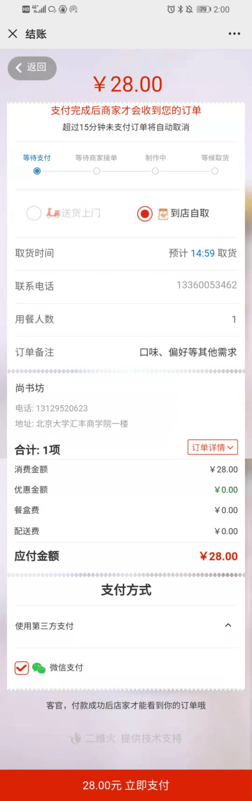
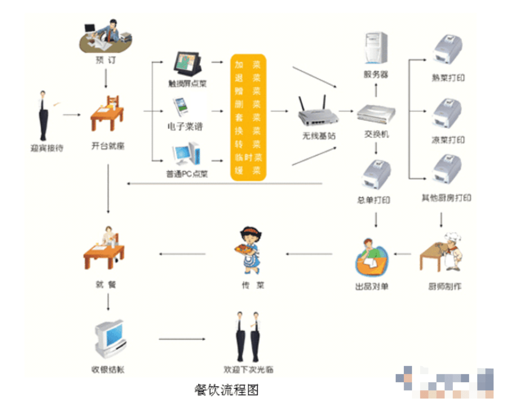
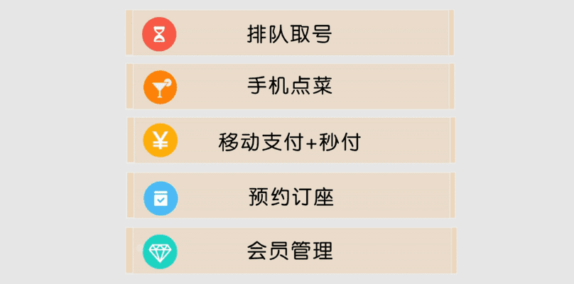
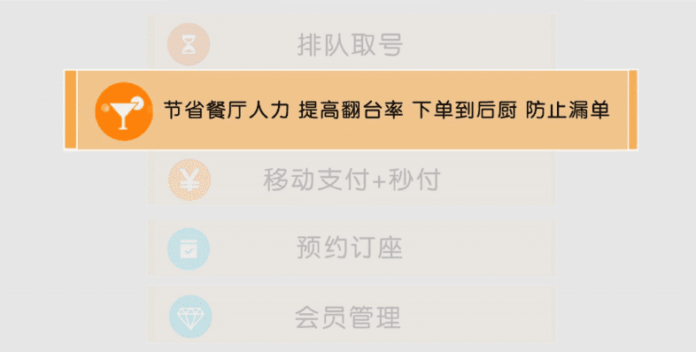
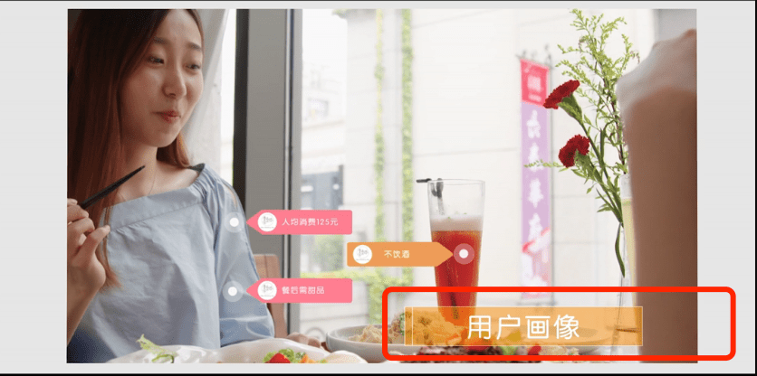

[外卖帮:多分析这个案例](https://www.wdd88.com/)

[大学论语购买的方案](公众号+h5(微信环境点餐))    (技术提供方:二维火)

[竞品:易石软件](http://www.yumstone.com/enterprise/showEnterPriseCulture.html)

[流程图原文链接](https://www.fanpusoft.com/canyinn/dt/761181.html)

[有人在知乎卖餐饮类ERP](https://zhuanlan.zhihu.com/p/305140986)

功能要求:餐饮行业细分又有7个子行业。每个子行业的要求又不同。涉及的环节有很多：采购订货，原材料的进销存管理，物流运输，菜品管理，无线点餐，会员管理，促销活动，成本管理，利润分析等等。这个领域的竞争也很激烈，四五年前甚至更早就有公司开始做了。

[知乎一篇讨论餐饮行业Saas:带营收和净利分析](https://www.zhihu.com/question/263597074/answer/389612153)

[客如云SaaS](http://www.keruyun.com/?pinzhuan)
[客如云wap](https://wap.keruyun.com/)
[客如云加入阿里本地生态](https://wap.keruyun.com/new_pc/zh/cy/?source=baidu-PC&plan=%E7%95%99%E7%94%B5%E8%AF%8D%E6%8B%93%E8%AF%8D-%E5%9C%A8%E7%BA%BF%E6%B5%8B%E8%AF%95%EF%BC%88%E6%B8%A0%E9%81%93%EF%BC%89&unit=%E7%82%B9%E8%8F%9C%E7%B3%BB%E7%BB%9F&keyword=%E7%82%B9%E8%8F%9C%E5%AE%9D%E7%82%B9%E9%A4%90%E8%BD%AF%E4%BB%B6&e_keywordid=205939241196&e_keywordid2=205939241196&sdclkid=ALos152G15fR152zA-&bd_vid=7510033983249049721)

[百度百科:点餐软件](https://baike.baidu.com/item/%E7%82%B9%E9%A4%90%E8%BD%AF%E4%BB%B6/1197483?fr=aladdin)

[竞品:美味不用等](http://www.mwee.cn/)

[竞品:美味不用等,天猫的广告](https://detail.tmall.com/item.htm?spm=a1z10.5-b-s.w4011-15279637029.127.85704540JGEJKp&id=573308212175&rn=034093f9c1a629e911d55ee732c90ece&abbucket=9)

[竞品(智掌柜):以设备为入口的管理系统](https://detail.tmall.com/item.htm?id=616219110445&ali_refid=a3_430582_1006:1229960013:N:CZFdQftG8ukMus3VRnw7gXDSe2FhMQnM:9f4abc4a22155ded470347c95bee7cae&ali_trackid=1_9f4abc4a22155ded470347c95bee7cae&spm=a230r.1.14.11&skuId=4344174737954)
* 外卖功能 `美团外卖`  `饿了么外卖` (杀手级应用??封杀了二维火)
* 后厨管理:智能分单,一菜一单
* 连锁管理:总分账号
* 智能点餐: 收银台点餐,手机点餐,二维码点餐
* 前厅管理:拼桌,拆桌,换桌,加价折扣
* 营销管理:会员管理,卡券印花,副屏广告
* 软件功能:一键拍照录菜
* 手持设备支持(管理员在远程看到经营的数据)

我们致力于为餐厅打造属于自己的私域流量池

[互站网的一个产品](https://www.huzhan.com/code/goods398758.html)

::: tip 功能介绍
程序价格（服务至上，切勿还价！）

套餐一：仅源码=3000元。

套餐二：代上线审核前端＋200元。

套餐三：包服务器域名一年＋1500元。

源码主要功能：（主要功能不代表全部详细功能，具体咨询客服。）

1.概况：运营概况、首页引导页、首页幻灯片、首页导航图标、首页公告、首页图片魔方

2.订单：外卖（未完成、已完成、催单、退单、所有订单）代客下单、调度中心指派接单、店内订单（未完成、催单、退单、所有订单）

3.当面付订单

4.数据：外卖统计、配送统计、营业统计、财务统计、顾客统计

5.商户：商户管理、商户账户、商户配送策略、商户活动、商户排序、商户提现、商户账户明细、商户入驻审核、商户入驻设置、商家资讯、商家资讯分类、商家广告列表、商家公告及投诉

6.售后：客户评价

7.配送员：配送员管理、配送政策、配送记录、配送员账户明细、提现记录、配送评价、配送员入口、其他

8.店员：店员管理列表、店员入口

9.顾客：顾客概况、顾客列表、顾客等级、顾客地址信息、顾客代金券红包、顾客财务明细、充值明细、积分明细

10.小程序：基础设置、订阅消息、支付方式、页面装修、底部导航、启动图、跳转小程序

11.配送员小程序：基础配置、订阅消息、底部导航、入口链接

12.商户小程序：基础配送、订阅消息、底部导航、入口链接

13.应用管理：配送会员卡、推广海报、达达配送对接、啦啦跑腿、DIY装修、配送员APP、下单有礼、千帆APP整合、马甲APP整合、商户APP、超级会员、超级红包、饿了么平台对接、推广、美团平台对接、小程序配置、区域代理、乐外卖采集、商户广告通、套餐红包、云商品库、大转盘、店铺业务员、UU跑腿对接、平台管理APP、啦啦生活圈、指定区域、准时宝、超值换购、闪送平台对接、隐私号、点我达配送平对接、外卖采集、全球化、客服系统、顾客端APP、多模板、天天特价、分享有礼、霸王餐、超级代金券、积分商城

14.设置：基础设置、分享关注、平台状态、oAuth设置、支付方式、支付回调、充值、提现方式、模板推送、短信设置、外卖服务范围、商户优选、商户配送费率、商户入驻活动、配送员申请、配送提现、优惠相关活动、敏感词、顾客设置、其他标签设置、入口链接。

15.权限：角色管理、操作员管理、操作日志。
:::

