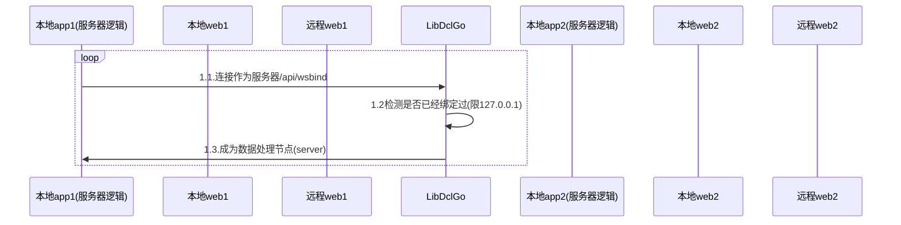
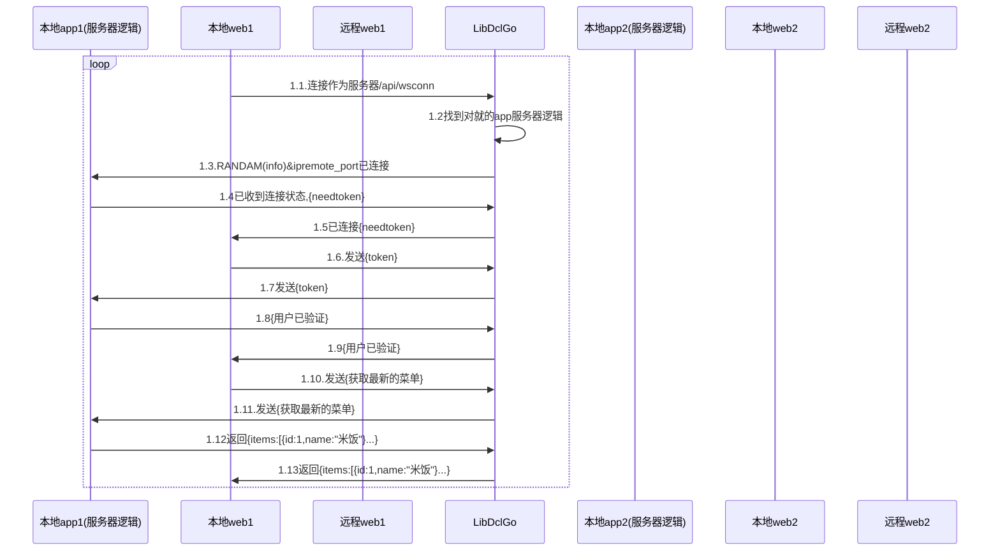

---

title: 点餐代码顺序图websocket
date: 2020-12-16 14:49:25
permalink: /pages/2235127/
categories:
  - 其它
  - 点餐了
tags:
  - 
---

|  版本   | 时间  |   作者   | 备注  |
|:- |:- |:- |:- |
|    1.0.1    |  2020-12-16     |   何发宝      |   初稿    |
|        |       |         |       |

客户链v1.0.2产品需求整理:顺序图
::: tip 绑定自己为ws长连接到LibGo(处理:长连接,权限,打印,数据库)
:::

客户链v1.0.2产品需求整理:顺序图
::: tip 连接服务器ws长连接
:::

