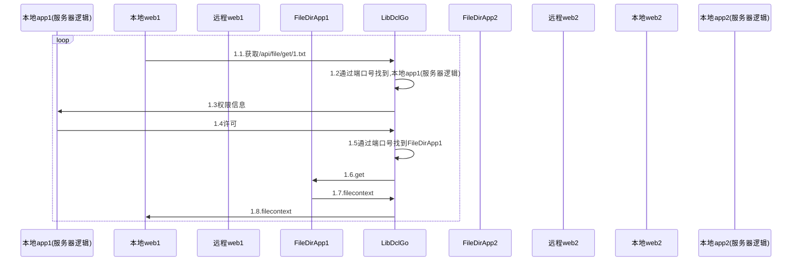

---

title: 点餐代码顺序图file
date: 2020-12-16 14:49:27
permalink: /pages/32343247/
categories:
  - 其它
  - 点餐了
tags:
  - 
---

|  版本   | 时间  |   作者   | 备注  |
|:- |:- |:- |:- |
|    1.0.1    |  2020-12-16     |   何发宝      |   初稿    |
|        |       |         |       |

::: tip get或post等操作
:::

