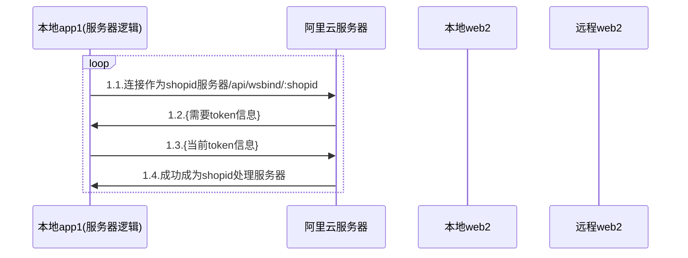
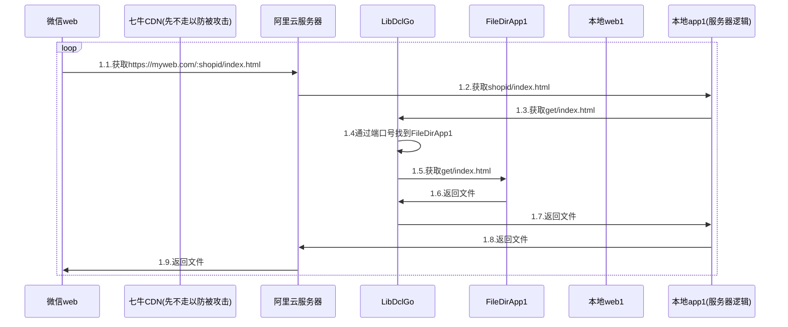
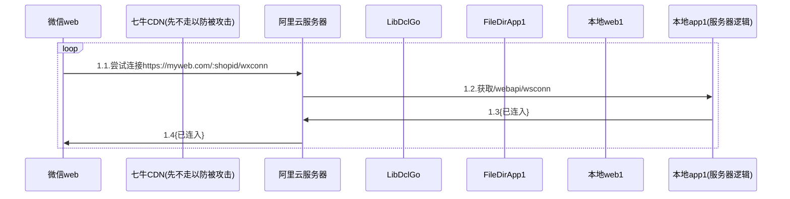

---

title: 点餐代码顺序图center
date: 2020-12-16 14:49:29
permalink: /pages/3302733/
categories:
  - 其它
  - 点餐了
tags:
  - 
---

|  版本   | 时间  |   作者   | 备注  |
|:- |:- |:- |:- |
|    1.0.1    |  2020-12-16     |   何发宝      |   初稿    |
|        |       |         |       |

::: tip 绑定自己为ws长连接到阿里云服务器(处理:长连接,文件)
:::

::: tip 微信web 获取当前店家使用的插件信息(index.html`版本不同,每个店家都`)
:::

::: tip 微信web ws长连接
:::

