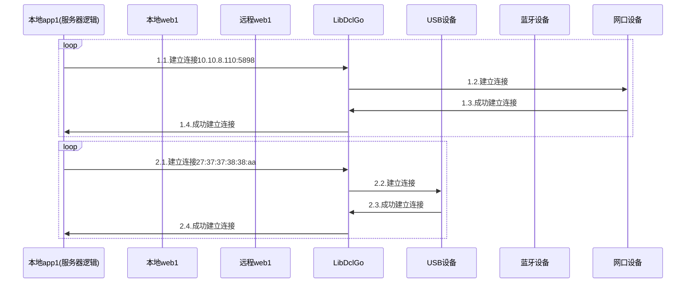

net-socket网络(作为ws长连接内部命令的一部分)
蓝牙设备(作为ws长连接内部命令的一部分)

::: tip 主动去连接usb,蓝牙,网口打印机
:::

```mermaid
sequenceDiagram
participant 本地app1(服务器逻辑)
participant 本地web1
participant 远程web1
participant LibDclGo
participant USB设备
participant 蓝牙设备
participant 网口设备
loop 
    本地app1(服务器逻辑)->>LibDclGo:1.1.建立连接10.10.8.110:5898
    LibDclGo->>网口设备:1.2.建立连接
    网口设备->>LibDclGo:1.3.成功建立连接
    LibDclGo->>本地app1(服务器逻辑):1.4.成功建立连接
end

loop 
    本地app1(服务器逻辑)->>LibDclGo:2.1.建立连接27:37:37:38:38:aa
    LibDclGo->>USB设备:2.2.建立连接
    USB设备->>LibDclGo:2.3.成功建立连接
    LibDclGo->>本地app1(服务器逻辑):2.4.成功建立连接
end

``` 
