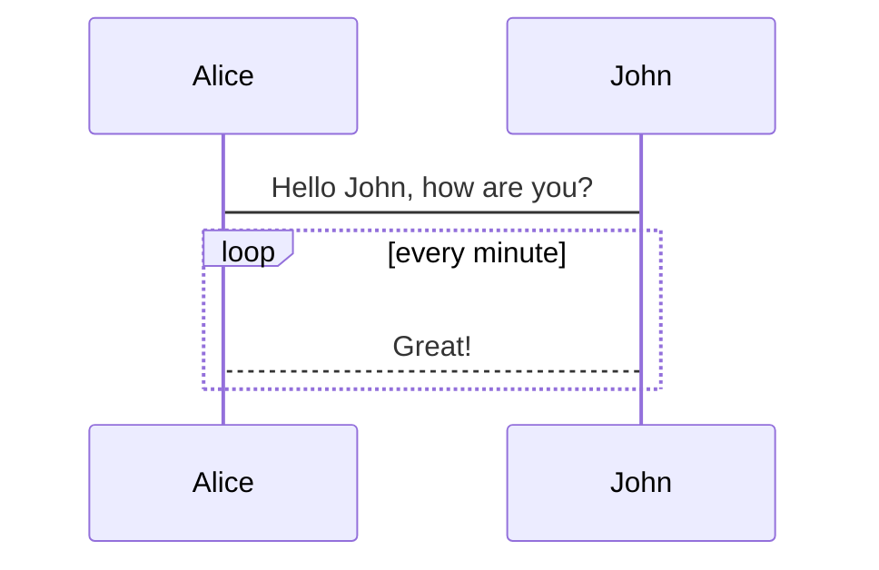
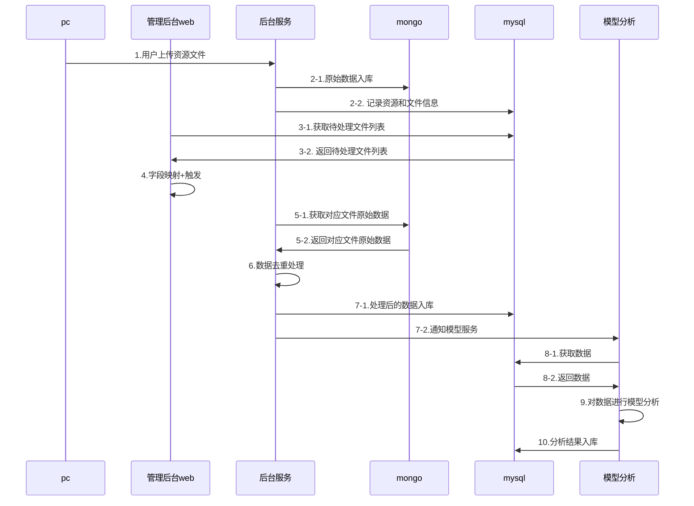

[包使用说明](https://github.com/eFrane/vuepress-plugin-mermaidjs)

 1111 

文档的参考样例:

|  版本   | 时间  |   作者   | 备注  |
|:- |:- |:- |:- |
|    0.1    |  2020-12-01     |   daizuming      |   初稿    |
|        |       |         |       |

客户链v1.0.2产品需求整理:顺序图

