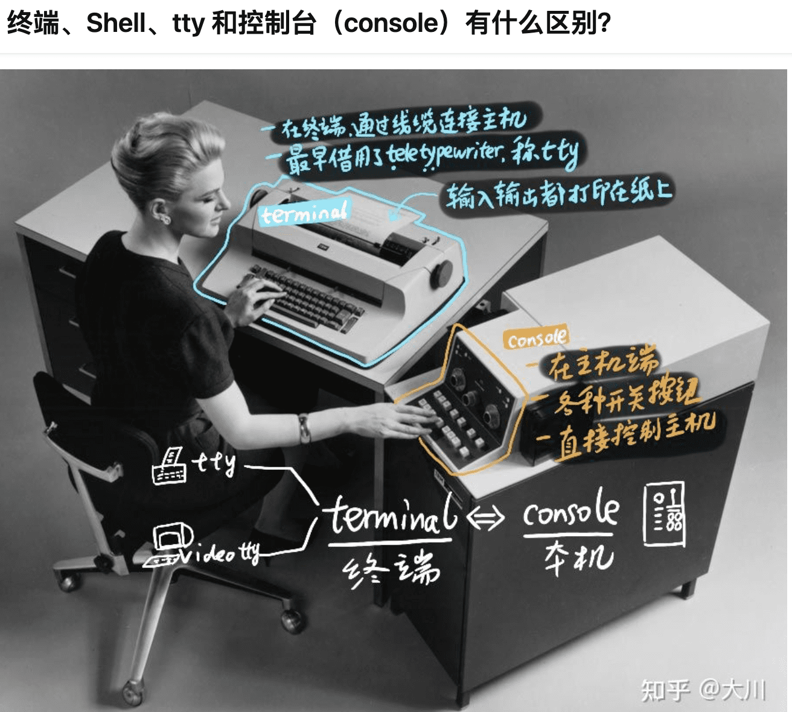

## tty
  * TTY，是teletypewriter的缩写，翻译过来就是电传打字机。当涉及到Linux或UNIX时，一定会听说过“TTY”一词

## 为什么要了解
  * 好奇ssh连接到服务器做了什么
  * TTY(Pseudo-TTY，即假冒的TTY，也叫做“PTY”

## Tmux伪终端
  * 本来是想把Tmux和Screen一起说的，但是Screen和Tmux原理几乎是一模一样，所以就省掉了Screen，这里只说Tmux：

## 数据流
  * 1. 有人在远端的Windows主机上敲入一个字符“a”；
  * 2. 字符“a”经由SSH客户端加密后传输到Linux SSH服务器SSHd并解密；
  * 3. 字符“a”通过SSHd的ptmx写入
  * 4. Tmux Server从pts/2将字符“a”读出并写入ptmx；
  * 5. Bash0将字符“a”从pts/1读出并执行；
  * 6. Bash0将-bash: a: command not found按原路返回给Windows。

[参考](https://blog.csdn.net/dog250/article/details/78818612)

[参考2](https://www.zhihu.com/question/21711307)

