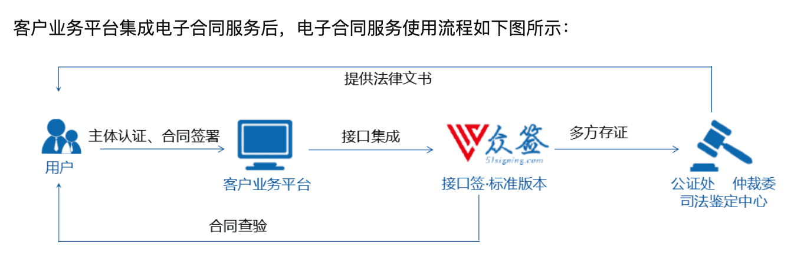

::: tip
电子合同是《中华人民共和国合同法》规定的的书面合同形式的一种，指双方或多方当事人之间通过电子信息网络以电子的形式达成的设立、变更、终止财产性民事权利义务关系的协议。电子合同包含身份认证、数字证书、电子签名、时间戳、存证保全和法律支持等服务，其法律效力和和纸质合同同等，但与纸质合同不同的是，电子合同可全程在线发起、签署、归档和管理，无须打印，具有使用简单、管理便捷等特点。因此，简单而言，电子合同是指参与方全程在线签署且具备和纸质合同同等法律效力的合同形式。
:::

[原文链接](https://www.zhihu.com/question/24294679/answer/243832029)

* 在线合约
