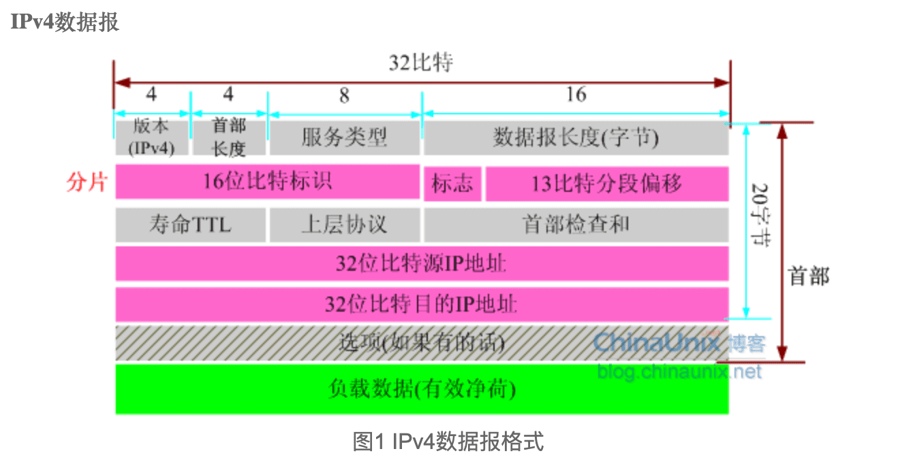
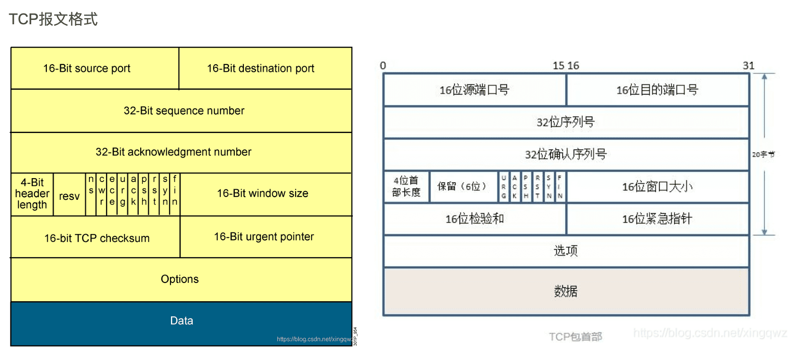
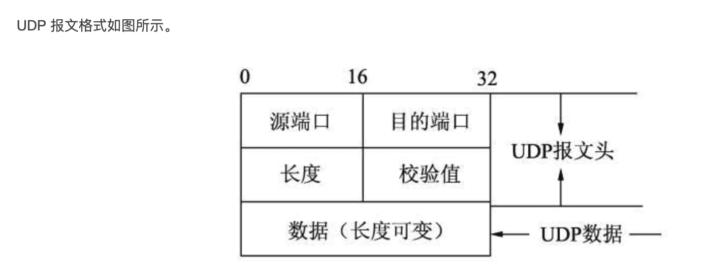

[IPV4数据报头部格式](http://blog.chinaunix.net/uid-9112803-id-3206178.html)

* 版本号(version)
* 首部长度(HL, Internet Head Length)
* 服务类型(TOS, Type Of Service)
* 数据报长度(TL, Total Length)
* 分片：标识(identification)、标志(flags)、段位移(Fragment Offset)
* 寿命(TTL, Time To Live) :而确保数据报不会永远在网络循环
* 上层协议(Protocol)
* 首部检查和(Header Checksum) :只是对IP首部进行检验
* 源和目的IP地址(Source/Destination Address)
* 选项(Options)
* 数据(Data)  : 当使用TCP/UDP协议时，数据即为传输层报文段(TCP/UDP)。数据字段也可承载其他类型数据，如ICMP报文段

[Tcp包结构](https://blog.csdn.net/xingqwz/article/details/108447353)

[百度ipv4简介原文链接](https://baike.baidu.com/item/IPv4/422599?fr=aladdin)

## 定义
网际协议版本4（英语：Internet Protocol version 4，IPv4），又称互联网通信协议第四版，是网际协议开发过程中的第四个修订版本，也是此协议第一个被广泛部署的版本

