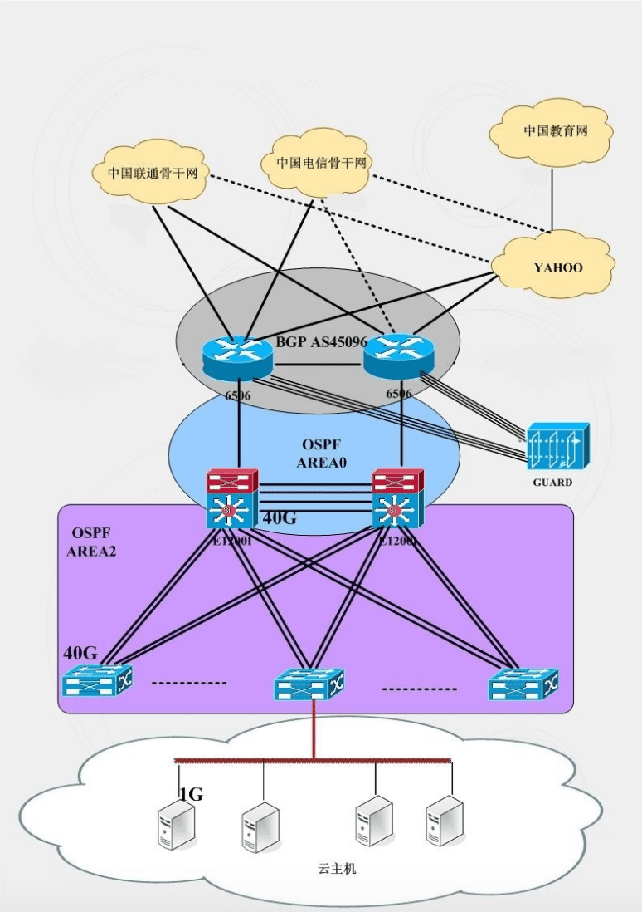
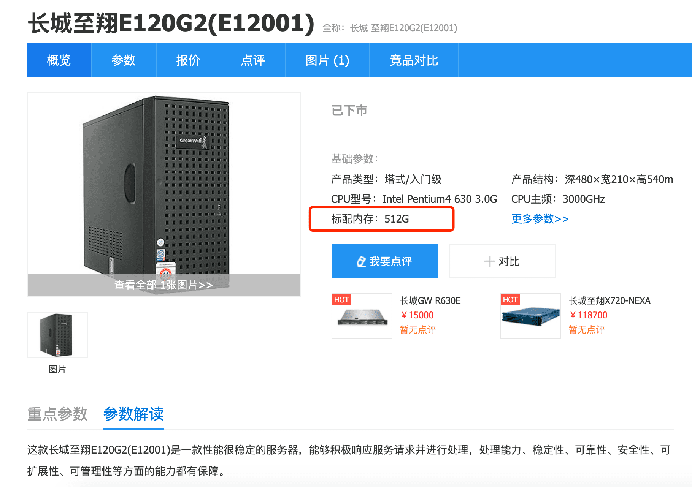
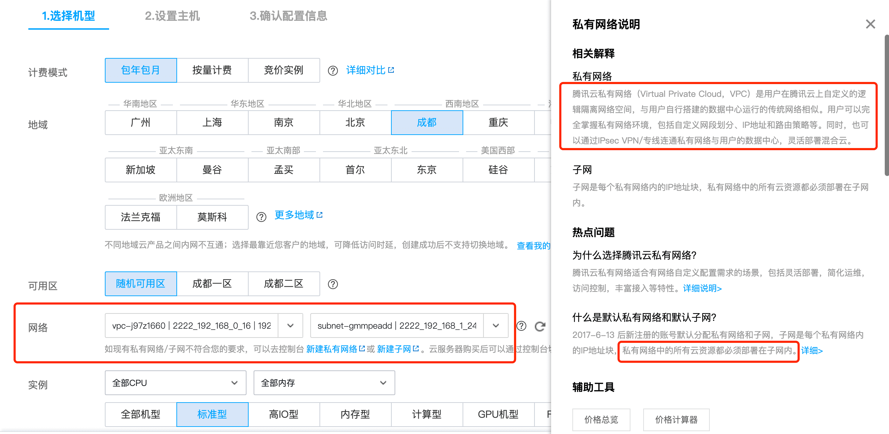

北京和杭州云虚拟主机机房网络拓扑图

[原文链接](https://help.aliyun.com/knowledge_detail/44600.html)

[参考学习链接-带原文件](https://www.bilibili.com/read/cv9113011/)

::: tip
阿里云机房是中国最大的5A机房之一，拥有世界领先的基础设置建设等级，保障机房无任何单点故障。不仅拥有超强计算能力，同时提供基于云端的DDoS防御、入侵防御和网站的应用安全监测服务，运维管理团队具备高专业度，确保所有的规范、制度、预案的精确执行。
:::

北京和杭州云虚拟主机机房的网络拓扑图如下所示。

VPC全称:(Virtual Private Cloud)是公有云上私有网络
ERP全称:企业资源计划(Enterprise Resource Planning，简称ERP)系统是一种主要面向制造行业进行物质资源、资金资源和信息资源集成一体化管理的企业信息管理系统

