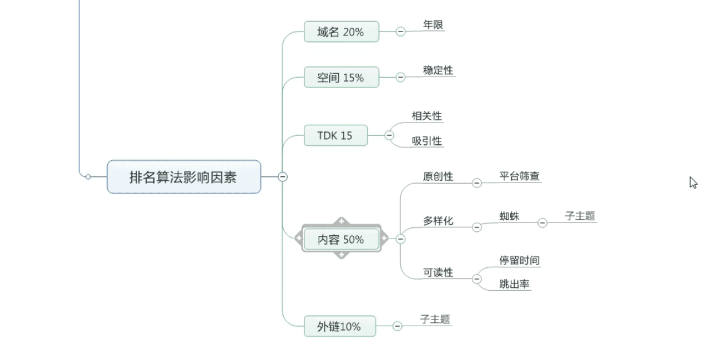
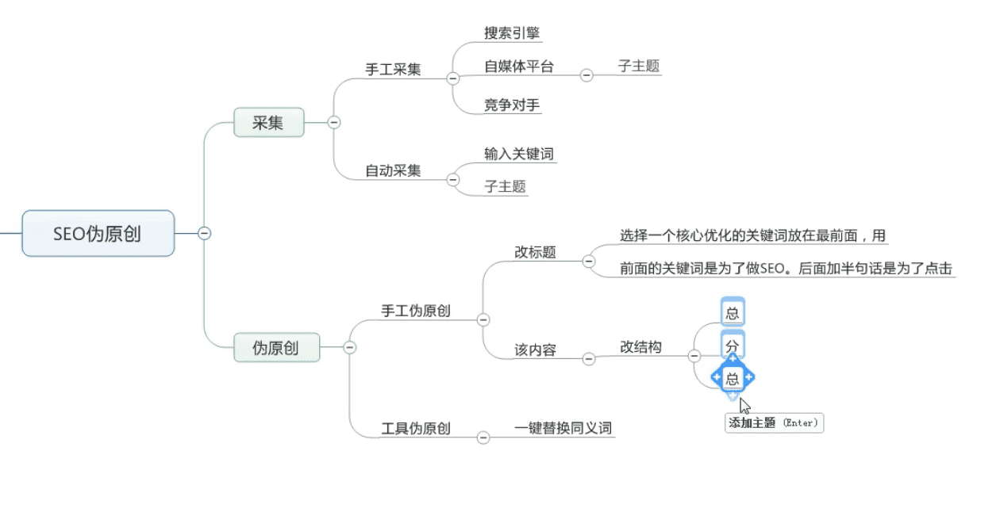

搜索引索:把最符合用户需求的答案,放到前20

::: tip  案例 `七夕节送什么`
1,问答需求

`百度知道` `知乎` `婚礼记`

分析:为什么有婚礼记-->有一个大项七夕大选项卡 `内容丰富` 一个网站运行越久,权重越高
:::

案例: `美丽说`  帮助淘宝卖家进行搜索引擎推广

pv:6000 seo圈  `两套` : `一套针对搜索引擎` `一套针对用户体验`

PGC: 意见领袖 高价值原创内容

* PV（Page View）访问量, 即页面浏览量或点击量，衡量网站用户访问的网页数量；在一定统计周期内用户每打开或刷新一个页面就记录1次，多次打开或刷新同一页面则浏览量累计。
* UV（Unique Visitor）独立访客，统计1天内访问某站点的用户数(以cookie为依据);访问网站的一台电脑客户端为一个访客。可以理解成访问某网站的电脑的数量。网站判断来访电脑的身份是通过来访电脑的cookies实现的。如果更换了IP后但不清除cookies，再访问相同网站，该网站的统计中UV数是不变的。如果用户不保存cookies访问、清除了cookies或者更换设备访问，计数会加1。00:00-24:00内相同的客户端多次访问只计为1个访客。
* IP（Internet Protocol）独立IP数，是指1天内多少个独立的IP浏览了页面，即统计不同的IP浏览用户数量。同一IP不管访问了几个页面，独立IP数均为1；不同的IP浏览页面，计数会加1。 IP是基于用户广域网IP地址来区分不同的访问者的，所以，多个用户（多个局域网IP）在同一个路由器（同一个广域网IP）内上网，可能被记录为一个独立IP访问者。如果用户不断更换IP，则有可能被多次统计。
* 会话次数（网站访问量）Session 会话是指在指定的时间段内在您的网站上发生的一系列互动，所以会话次数是一段时间内用户向您的网站发起的会话（Session）总数量。一次会话会浏览一个或多个页面

[seo伪原创文章原来需要这么写，才算是高质量文章](https://www.bilibili.com/video/BV1qt4y1i7sg?from=search&seid=7796787513302502141)

