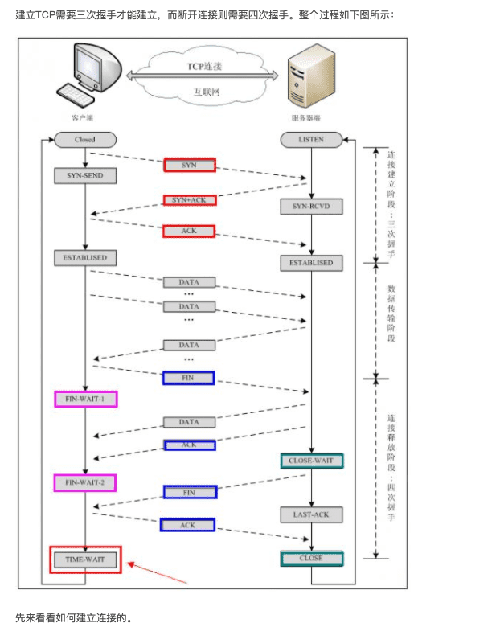
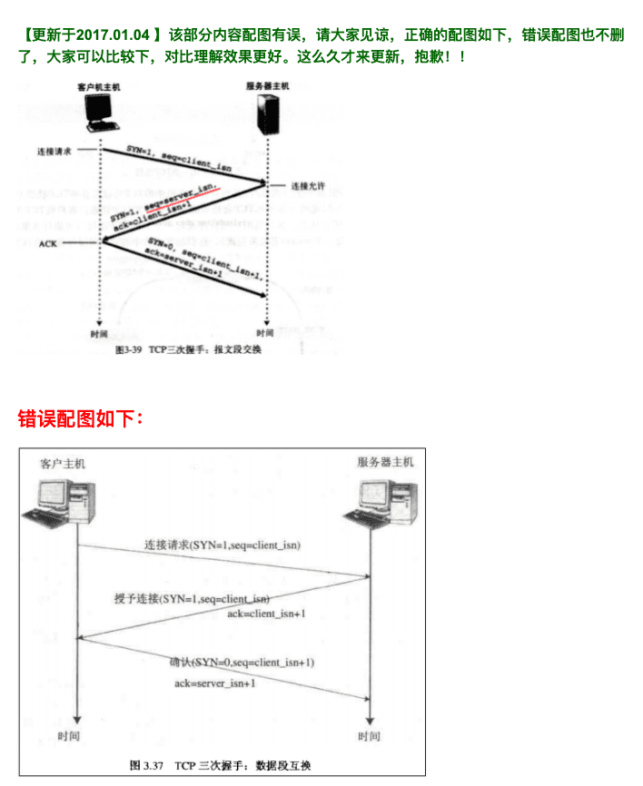
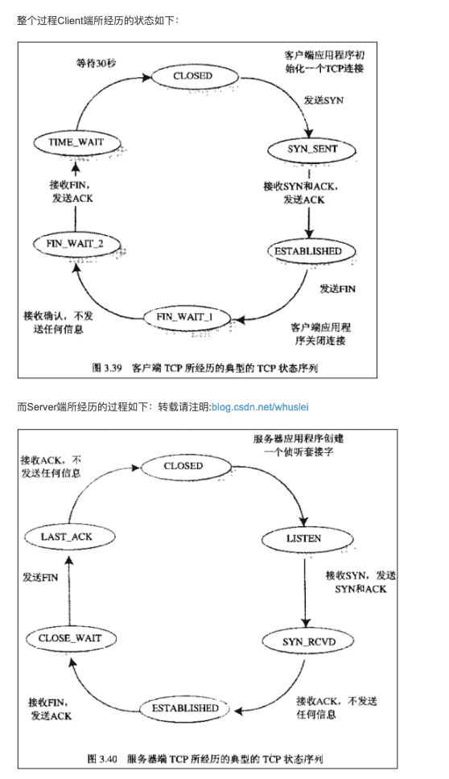

* # TCP协议中的三次握手和四次挥手(图解) https://blog.csdn.net/whuslei/article/details/6667471

* 【问题1】为什么连接的时候是三次握手，关闭的时候却是四次握手？
  答：因为当Server端收到Client端的SYN连接请求报文后，可以直接发送SYN+ACK报文。其中ACK报文是用来应答的，SYN报文是用来同步的。但是关闭连接时，当Server端收到FIN报文时，很可能并不会立即关闭SOCKET，所以只能先回复一个ACK报文，告诉Client端，"你发的FIN报文我收到了"。只有等到我Server端所有的报文都发送完了，我才能发送FIN报文，因此不能一起发送。故需要四步握手。

* 【问题2】为什么TIME_WAIT状态需要经过2MSL(最大报文段生存时间)才能返回到CLOSE状态？

答：虽然按道理，四个报文都发送完毕，我们可以直接进入CLOSE状态了，但是我们必须假象网络是不可靠的，有可以最后一个ACK丢失。所以TIME_WAIT状态就是用来重发可能丢失的ACK报文。

答：根据第三版《UNIX网络编程 卷1》2.7节，TIME_WAIT状态的主要目的有两个： https://cloud.tencent.com/developer/article/1450264

- 优雅的关闭TCP连接，也就是尽量保证被动关闭的一端收到它自己发出去的FIN报文的ACK确认报文；
- 处理延迟的重复报文，这主要是为了避免前后两个使用相同四元组的连接中的前一个连接的报文干扰后一个连接。

很明显，要实现上述两个目标，TIME_WAIT状态需要持续一段时间，但这段时间应该是多长呢？

如果只考虑上述第一个目标，则TIME_WAIT状态需要持续的时间应该参考对端的RTO（重传超时时间）以及MSL（报文在网络中的最大生存时间）来计算而不是仅仅按MSL来计算，因为只要对端没有收到针对FIN报文的ACK，就会一直持续重传FIN报文直到重传超时，所以最能实现完美关闭连接的时长计算方式应该是从对端发送第一个FIN报文开始计时到它最后一次重传FIN报文这段时长加上MSL，但这个计算方式过于保守，只有在所有的ACK报文都丢失的情况下才需要这么长的时间；另外，第一个目标虽然重要，但并不十分关键，因为既然已经到了关闭连接的最后一步，说明在这个TCP连接上的所有用户数据已经完成可靠传输，所以要不要完美的关闭这个连接其实已经不是那么关键了。因此，（我猜）RFC标准的制定者才决定以网络丢包不太严重为前提条件，然后根据第二个目标来计算TIME_WAIT状态应该持续的时长。

MSL: Maximum Segment Lifetime (最大分段生存时间)

* 
* 
* tcp基础知识
* 参考 https://blog.csdn.net/li_haijiang/article/details/70807854
* 为什么三次握手:  在谢希仁著《计算机网络》第四版中讲“三次握手”的目的是“为了防止已失效的连接请求报文段突然又传送到了服务端，因而产生错误”。在另一部经典的《计算机网络》一书中讲“三次握手”的目的是为了解决“网络中存在延迟的重复分组”的问题。
* 为什么要四次分手挥手: TCP协议是一种面向连接的、可靠的、基于字节流的运输层通信协议。TCP是`全双工模式`，这就意味着，当主机1发出FIN报文段时，只是表示主机1已经没有数据要发送了，主机1告诉主机2，它的数据已经全部发送完毕了；但是，这个时候主机1还是可以接受来自主机2的数据；当主机2返回ACK报文段时，表示它已经知道主机1没有数据发送了，但是主机2还是可以发送数据到主机1的；当主机2也发送了FIN报文段时，这个时候就表示主机2也没有数据要发送了，就会告诉主机1，我也没有数据要发送了，之后彼此就会愉快的中断这次TCP连接

* wireshark抓包,百度服务器挥手最后的包使用了是reset的方式结束tcp https://blog.51cto.com/u_418324/2343419

