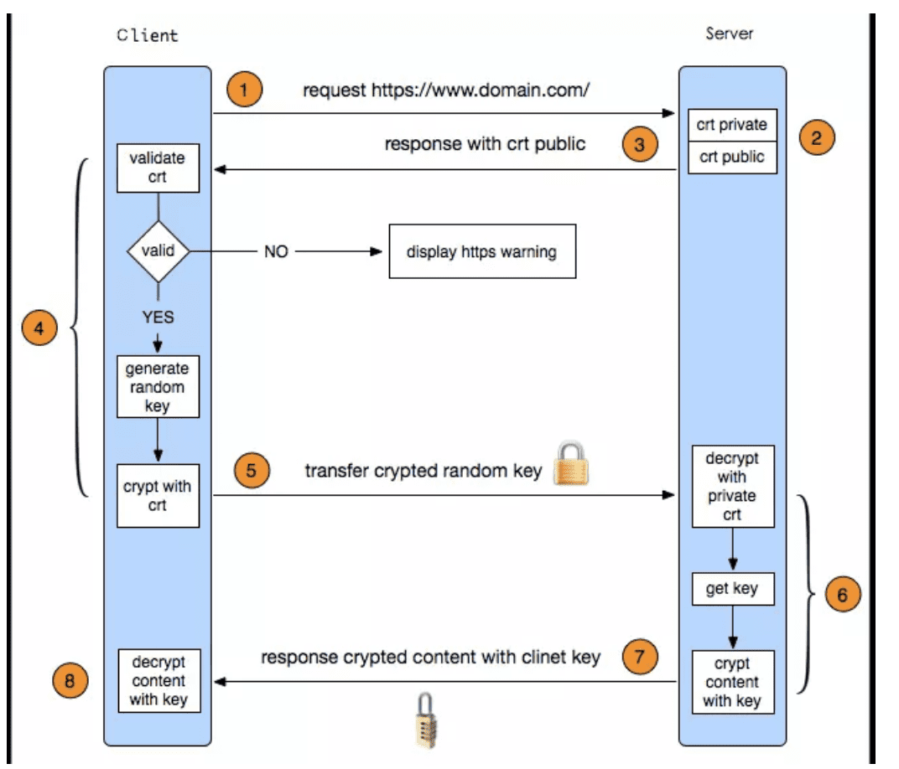
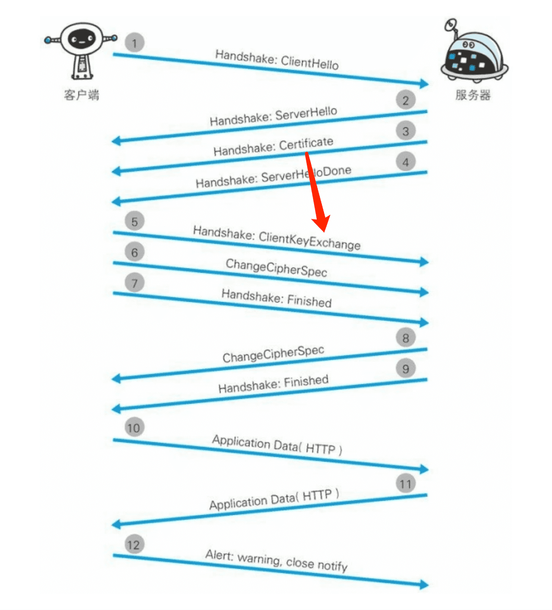
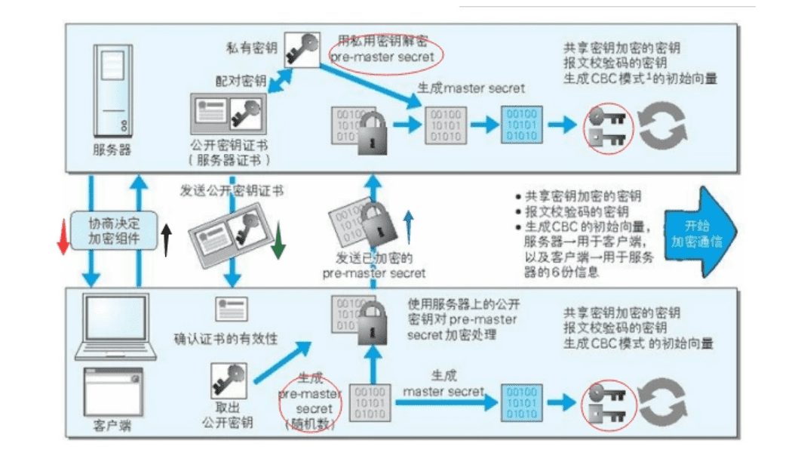

::: tip 基本观点
自己设计的安全方式99%都是不靠谱的 `重放`  `中间人` 等等攻击方式
:::

[原文链接](https://studygolang.com/articles/28163)

## https通信过程如下图所示

[第二个参照链接](https://segmentfault.com/a/1190000017850148)

[为什么Wireshark无法解密HTTPS数据](https://blog.csdn.net/linuxnews/article/details/51900900)

