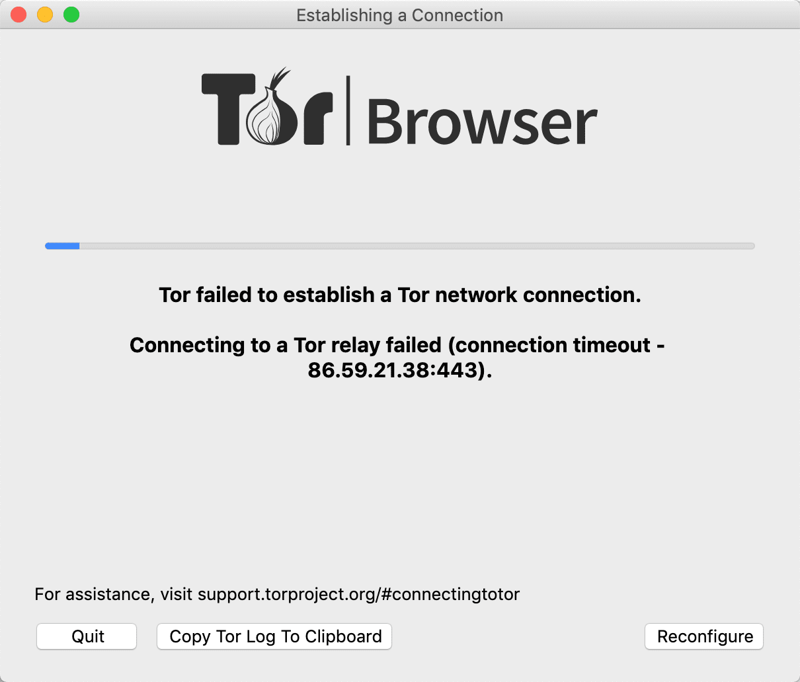
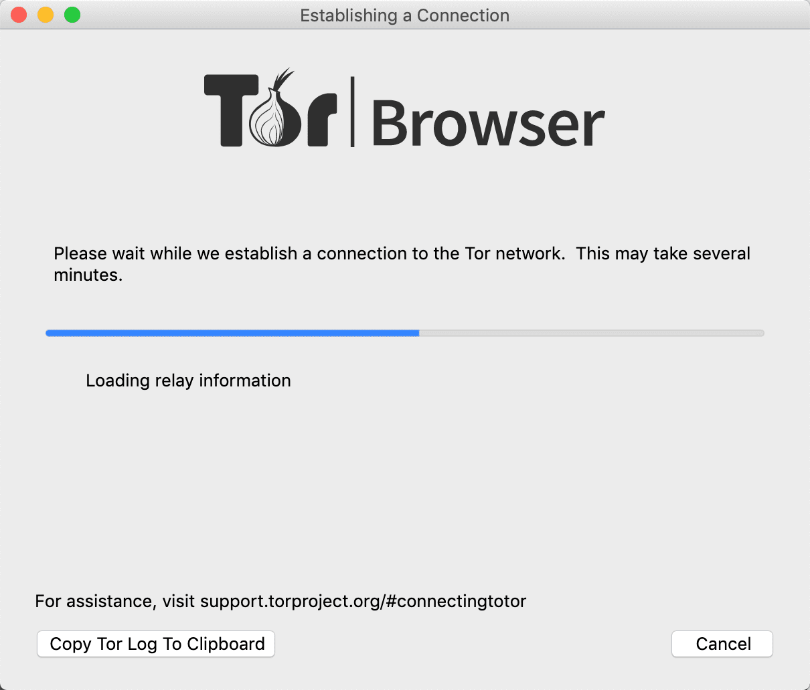

tor:洋葱路由器Tor（The Onion Routel network)

* tor浏览器源码git https://github.com/torproject/tor
* tor浏览器官网 https://www.torproject.org/
* 视频介绍原理 https://c.m.163.com/news/v/VQRUKVULS.html?spss=newsapp&spssid=bd5b9583be2af26bb2a2309b104e7df1&spsw=1

* 洋葱访问的特征码识别问题  : connecting to a tor relay fialed

* 

*