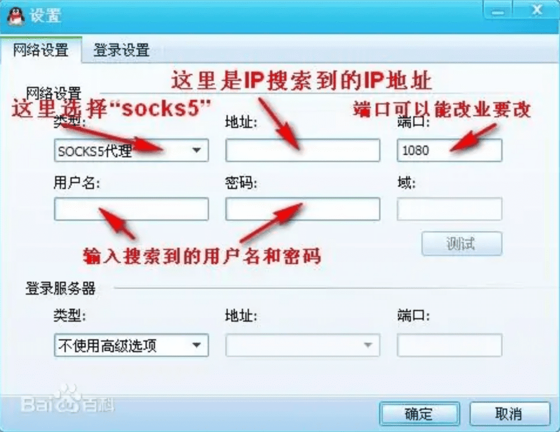
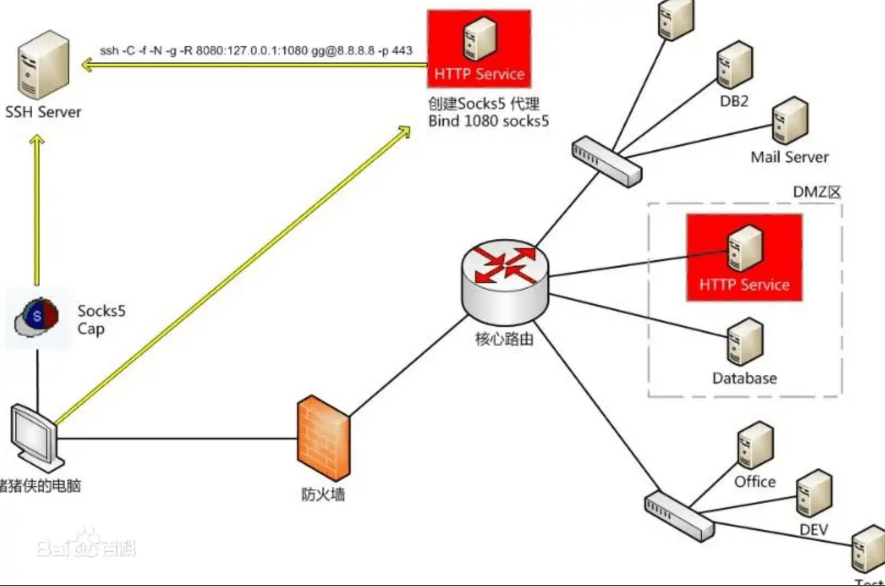

* 一款轻量级、高性能、功能强大的内网穿透代理服务器。支持tcp、udp、socks5、http等几乎所有流量转发，可用来访问内网网站、本地支付接口调试、ssh访问、远程桌面，内网dns解析、内网socks5代理等等……，并带有功能强大的web管理端。a lightweight, high-performance, powerful intranet penetration proxy server, with a powerful web management terminal.

* 代码git路径 https://github.com/ehang-io/nps
* 使用功能文档  https://ehang-io.github.io/nps/#/example?id=tcp%e9%9a%a7%e9%81%93 
* web_username=admin
* web_password=123

::: tip 
SOCKS5 是一个代理协议，它在使用TCP/IP协议通讯的前端机器和服务器机器之间扮演一个中介角色，使得内部网中的前端机器变得能够访问Internet网中的服务器，或者使通讯更加安全。SOCKS5 服务器通过将前端发来的请求转发给真正的目标服务器， 模拟了一个前端的行为。在这里，前端和SOCKS5之间也是通过TCP/IP协议进行通讯，前端将原本要发送给真正服务器的请求发送给SOCKS5服务器，然后SOCKS5服务器将请求转发给真正的服务器
:::

* brew用curl下载，所以给curl挂上socks5的代理即可。
  * 在~/.curlrc文件中输入代理地址即可。
    * socks5 = "127.0.0.1:1080"

* golang 设置代理 proxy
  * 设置GOPROXY代理：
    * go env -w GOPROXY=https://goproxy.cn,direct

