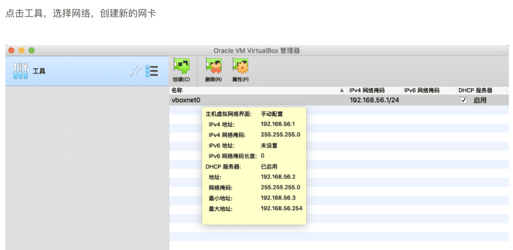

virtualbox 虚拟机  bridge 网络 固定ip `ubuntu`

``` bash
sudo vim /etc/netplan/00-installer-config.yaml
```

``` yaml
# This is the network config written by 'subiquity'
network:
  ethernets:
    enp0s3:
      dhcp4: true
      gateway4: 10.0.2.2
    enp0s8:
      dhcp4: no
      dhcp6: no
      addresses: 
        - 192.168.56.110/24
      gateway4: 10.0.2.2
      nameservers:
        addresses: [223.5.5.5,114.114.114.114]  # DNS服务器地址，多个DNS服务器地址需要用英文逗号分隔开，可不配置

  version: 2
```

``` yaml
# This is the network config written by 'subiquity'
network:
  ethernets:
    enp0s3:
      dhcp4: true
      gateway4: 10.0.2.2
    enp0s8:
      dhcp4: no
      dhcp6: no
      addresses: 
        - 192.168.56.111/24
      gateway4: 10.0.2.2
  version: 2
```


``` yaml
# This is the network config written by 'subiquity'
network:
  ethernets:
    enp0s3:
      dhcp4: true
      gateway4: 10.0.2.2
    enp0s8:
      dhcp4: no
      dhcp6: no
      addresses: 
        - 192.168.56.112/24
      gateway4: 10.0.2.2
  version: 2
```


