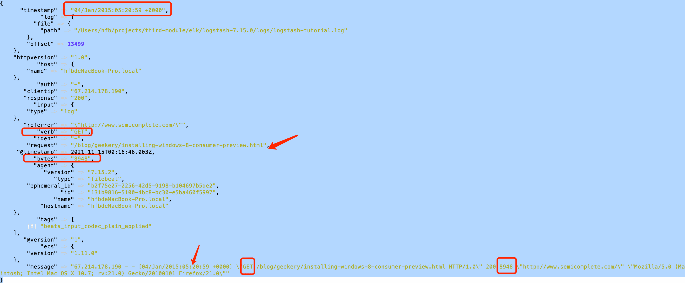

* logstash 检测配置文件是否可用
  * cd /Users/hfb/projects/third-module/elk/logstash-7.15.0 
  * bin/logstash --config.test_and_exit -f /Users/hfb/projects/go/mod-pro/docker-elk/logstash/pipeline/logstash.conf
  * bin/logstash --config.test_and_exit -f config/first-grok.yml
  


* 项目地址 cd /Users/hfb/projects/third-module/elk/logstash-7.15.0
    * logstash(helloworld)
    * bin/logstash -e 'input { stdin { } } output { stdout {} }'
* 检测配置文件    
    * ./bin/logstash -f config/first-pipeline.yml --config.test_and_exit
* 运行
    * ./bin/logstash -f config/first-pipeline.yml --config.reload.automatic
    * 使用grok进行过滤  可以过滤出nginx日志的时间,路径,文件大小,请求(get/post等等)
    * ./bin/logstash -f config/first-grok.yml --config.reload.automatic  
    * 过滤日志文件的geoip(ip转成物理地理信息)
    * ./bin/logstash -f config/first-geoip.yml --config.reload.automatic 
    * 把文件信息导出到es(elasticsearch)进行分析 (1:shards 1:replicas)
    * ./bin/logstash -f config/first-geoip.yml --config.reload.automatic
    *查看 curl -XGET 'localhost:9200/logstash-2021.11.15-000001/_search?pretty&q=response=200'
    
* 从filebeat里拿数据(已经把数据推到5044)
``` yml
input {
    beats {
        port => "5044"
    }
}
output {
    stdout { codec => rubydebug }
}
```


* 官方新手教程 https://www.elastic.co/guide/en/logstash/current/first-event.html
* 依赖项目 filebeat(https://github.com/elastic/beats/tree/master/filebeat) (使用的是go语言写的)


