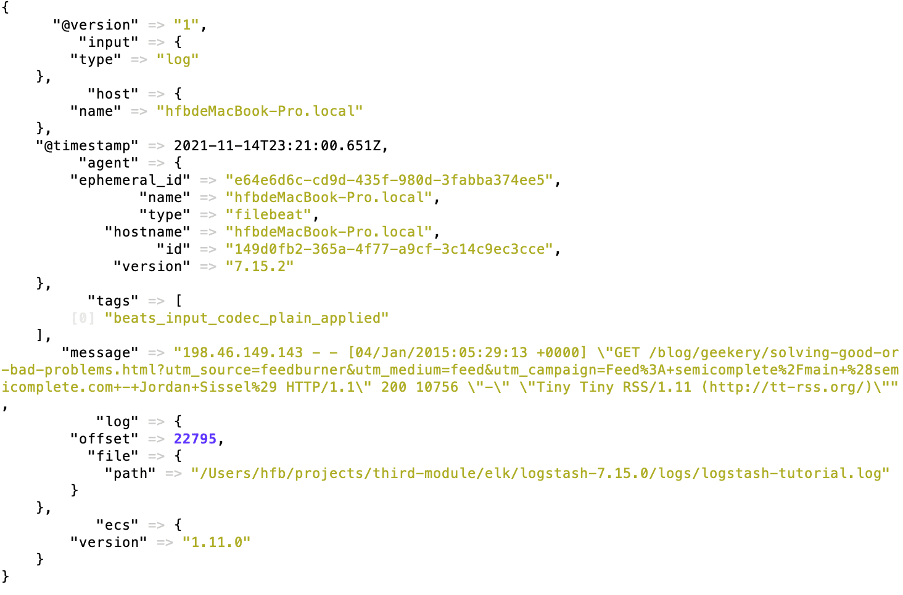

* 和logstash搭配来使用 #日志分析 
    * cd /Users/hfb/projects/third-module/elk/filebeat-7.15.2-darwin-x86_64/
    * ./filebeat -e -c /Users/hfb/projects/third-module/elk/filebeat-7.15.2-darwin-x86_64/module/tutor/example.yml -d "publish"
        * 需要路径全名 
    * 当你需要文件重新上传时,把data目录删除    
  

*  filebeat(https://github.com/elastic/beats/tree/master/filebeat) (使用的是go语言写的)


* /Users/hfb/projects/third-module/elk/filebeat-7.15.2-darwin-x86_64/module/tutor
``` yml
filebeat.inputs:
- type: log
  paths:
    - /Users/hfb/projects/third-module/elk/logstash-7.15.0/logs/logstash-tutorial.log
output.logstash:
  hosts: ["localhost:5044"]
```
    * https://artifacts.elastic.co/downloads/beats/filebeat/filebeat-7.15.2-darwin-x86_64.tar.gz
    * /Users/hfb/projects/third-module/elk/logstash-7.15.0/logs/logstash-tutorial.log


