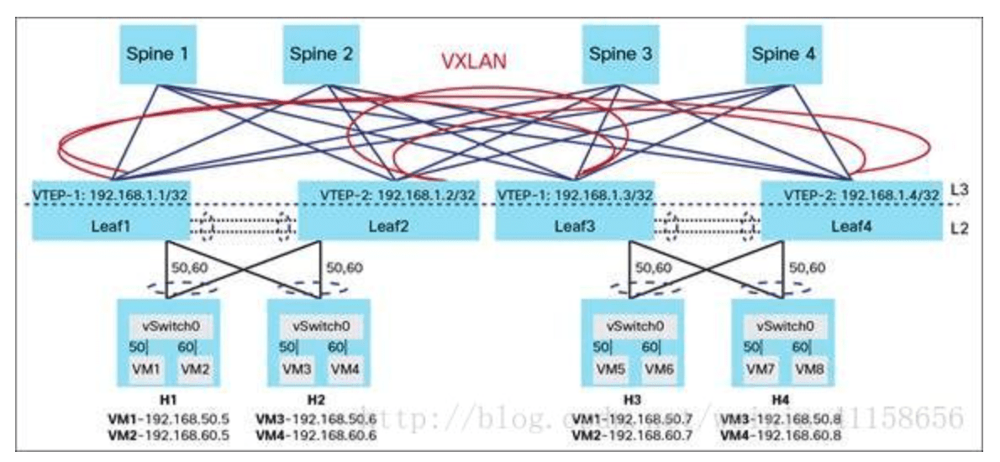

## 什么是大二层?
  * 简单的说整个互联网都是大二层
  * overlay(又叫叠加网络、覆盖网络)简单理解就是把一个逻辑网络建立在一个实体网络之上

## 腾讯云计算中心 重庆市 两江国际云计算产业园  `bilibili E企研究院`
 * 占地250亩
 * 2座全钢结构大平层机房楼
 * 模块化分区设计
 * 配电和柴发设备在南区
 * 冷却塔冷站在北区
 * 多层机房楼, t-base
 * 20万台服务器,计算存储能力  数据中心 网络中心

## TOR（Top of Rack）是一种数据中心的布线方式
  * TOR接入方式就是在标准的42U的服务器机柜的最上面安装接入交换机

* 数据中心网络DC 
  * 数据中心网络架构浅谈 https://blog.csdn.net/weixin_41158656/article/details/80133784
  * Spine/Leaf架构中的网络设计 (大二层): 
    * 以VXLAN为代表的Overlay技术解决的，更多是（个人观点）提供了一个不受物理网络限制的，可软件定义的网络环境。SDDC（Software Defined Data Center）
      * Overlay技术有很多中，GRE，NVGRE，Geneva，VXLAN
    * 
    * Leaf交换机（或者说VTEP）将VM的Ethernet Frame封装成VXLAN（也就是一个UDP包）
  * 关于VLAN和VXLAN的理解(udp包结构) : https://blog.csdn.net/octopusflying/article/details/77609199
    * VXLAN传输过程中，将逻辑链路网络的数据帧添加VXLAN首部后，依次添加UDP首部，IP首部，以太网帧首部后，在物理网络中传输，数据帧的封装格式可以用下图来描述
    * VTEP:隧道端点(VTEP):VTEP(VXLAN Tunnel Endpoint )负责VXLAN报文的封装与解封装。
    * VTEP节点可以由实现了VXLAN功能的交换机、路由器等硬件设备充当，但在更多的基于虚拟化技术实现的网络拓扑的应用中，VTEP节点的角色更多由部署了多台虚拟机的主机中的hypervisor进程来担任
      * Hypervisor，又称虚拟机监视器（英语：virtual machine monitor，缩写为 VMM）
  * 弹性ip
    * 网络过程和
      * 数据流发送过程(从本机到云主机)
        * src: 192.168.1.100:7865 dst: 220.181.38.148:443
          * 路由表 (netstat -rn) 通过二层发出
        * src: 113.87.97.63:8490?  dst: 220.181.38.148:443
          * 路由器 : 192.168.1.1 
          * 这里做了nat地址转换 , 8490 -> 192.168.1.100:7865
        * dst: 10.10.1.8:4789(udp)+(vxlan:8391?)+data(src: 113.87.97.63:8490?  dst: 220.181.38.148:443)
        * src: 113.87.97.63:8490? dst: 172.31.42.95:443
          * 虚拟机(VTEP) 把数据包解出

* 配置从 9123 端口映射到20000端口 (20000->8999 aaa容器)
    * cd 
    * 启动nginx Docker : docker run -d -v /home/hfb/tcp9123.conf:/etc/nginx/nginx.conf -v /home/hfb/log:/var/log/nginx -p 9123:9123 nginx:1.20.2
    * 

## 参考 `bilibili 四电老陈` `华为:数据中心网络架构及技术`

