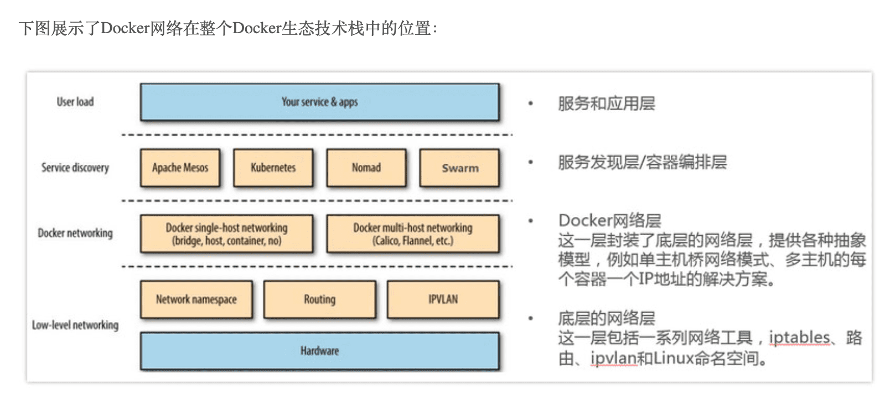

## flannel:
  * Flannel runs a small, single binary agent called flanneld on each host, and is responsible for allocating a subnet lease to each host out of a larger, preconfigured address space. Flannel uses either the Kubernetes API or etcd directly to store the network configuration, the allocated subnets, and any auxiliary data (such as the host's public IP). Packets are forwarded using one of several backend mechanisms including VXLAN and various cloud integrations.

## CNI CNI是Container Network Interface的是一个标准的，通用的接口
  * [参考](https://blog.csdn.net/zhonglinzhang/article/details/82697524) 
    
    * CNI插件是可执行文件，会被kubelet调用。启动kubelet --network-plugin=cni，--cni-conf-dir 指定networkconfig配置
    
    

[参考](https://www.kubernetes.org.cn/2059.html)

