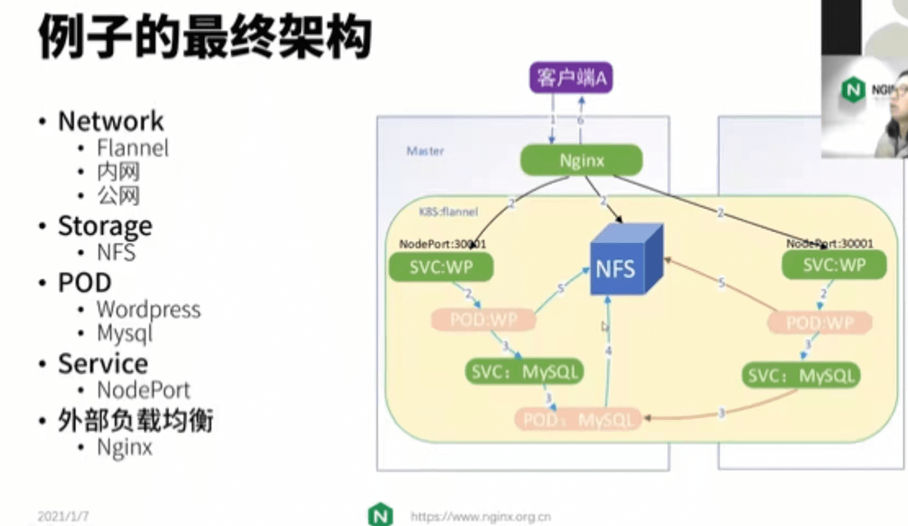

## **k8s high-level component architecture**
- **Legend**
  - **CNI**
  - **CRI**
  - **Protobuf**
  - **gRPC**
  - **JSON**

## Master
- **etcd**
- **Controller Manager**  `Controller Loops`
- **Api Server**
  - **Kubelet**
    - **Protobuf**
  - **User**
- **Sechduler**  `Bind Pod to Node`

## Node Poll
- **Networking**
- **Kubelet**
- **Container Runtime**
- **OS**
- **Hardware**
- **Node1**

## k8s重要组件
- **Ingress**  `对外负载均衡`
- **Service**  `四层网关/四层负载均衡`
- **Deployment**
- **Pod** `简单理解为虚拟机就好了` `可以有多个容器`
  - **Container**
- **CronJob**
- **Job**
- **HonrizontalPodAutoscaler**
- **ConfigMap**
- **Secret**
- **StatefulSet**
- **DaemonSet**

## 这个例子的最终架构  **最终的样子,顶层视角**
- **Network**
  - **Flannel**
  - **内网**
  - **公网**
- **Storage**
  - **NFS**
- **POD**
  - **Wordpress**
  - **Mysql**
- **Service**
  - **NodePort**
- **负载均衡**
  - **Nginx** `暂时挂在k8s外`
    - **后续**

[参考](https://www.bilibili.com/video/BV1Hz4y1S7fW?p=1&share_medium=android&share_plat=android&share_session_id=360ff5a3-6440-44c9-9097-8ca14d36b927&share_source=WEIXIN&share_tag=s_i&timestamp=1652023859&unique_k=5MYaek5)

