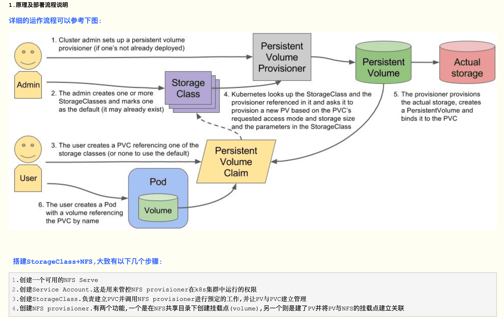

## 





## [参考](https://www.cnblogs.com/panwenbin-logs/p/12196286.html)


## 实践操作在 k8s1 集群 
- 节点: node1
- 目录: /home/hfb/test/sc

## **碰到的问题**
- **1.节点没有安装必要的软件: sudo apt install nfs-common**
  - [链接](/pages/894273/)
- **2.关于在k8s-v1.20以上版本使用nfs作为storageclass出现selfLink was empty, can‘t make reference**
  - 要在master节点上修改kube-api的配置
  - [参考](https://github.com/kubernetes-sigs/nfs-subdir-external-provisioner/issues/25)

kubectl get pod
kubectl get pod |grep nfs
kubectl get pvc


## 以下是用到的yaml
``` bash
hfb@node1:~$ cd /home/hfb/test/sc
hfb@node1:~/test/sc$ ls
d03.yaml  myubuntu00.yaml  sa01.yaml  sc02.yaml  t04.yaml  testformount  tpod05.yaml  tstateful-serverless-06.yaml
hfb@node1:~/test/sc$ cat myubuntu00.yaml
apiVersion: v1
kind: Pod
metadata:
 #Pod的名称，全局唯一
 name: myubuntu
 labels:
  name: myubuntu
spec:
  #设置存储卷
  containers:
   #容器名称
   - name: myubuntu
     #容器对应的Docker Image
     image: ubuntu
     command: [ "/bin/bash", "-c", "--" ]
     args: [ "while true; do sleep 3600; done;" ]
hfb@node1:~/test/sc$ cat sa01.yaml 
apiVersion: v1
kind: ServiceAccount
metadata:
  name: nfs-client-provisioner
  # replace with namespace where provisioner is deployed
  namespace: default        #根据实际环境设定namespace,下面类同
---
kind: ClusterRole
apiVersion: rbac.authorization.k8s.io/v1
metadata:
  name: nfs-client-provisioner-runner
rules:
  - apiGroups: [""]
    resources: ["persistentvolumes"]
    verbs: ["get", "list", "watch", "create", "delete"]
  - apiGroups: [""]
    resources: ["persistentvolumeclaims"]
    verbs: ["get", "list", "watch", "update"]
  - apiGroups: ["storage.k8s.io"]
    resources: ["storageclasses"]
    verbs: ["get", "list", "watch"]
  - apiGroups: [""]
    resources: ["events"]
    verbs: ["create", "update", "patch"]
---
kind: ClusterRoleBinding
apiVersion: rbac.authorization.k8s.io/v1
metadata:
  name: run-nfs-client-provisioner
subjects:
  - kind: ServiceAccount
    name: nfs-client-provisioner
    # replace with namespace where provisioner is deployed
    namespace: default
roleRef:
  kind: ClusterRole
  name: nfs-client-provisioner-runner
  apiGroup: rbac.authorization.k8s.io
---
kind: Role
apiVersion: rbac.authorization.k8s.io/v1
metadata:
  name: leader-locking-nfs-client-provisioner
    # replace with namespace where provisioner is deployed
  namespace: default
rules:
  - apiGroups: [""]
    resources: ["endpoints"]
    verbs: ["get", "list", "watch", "create", "update", "patch"]
---
kind: RoleBinding
apiVersion: rbac.authorization.k8s.io/v1
metadata:
  name: leader-locking-nfs-client-provisioner
subjects:
  - kind: ServiceAccount
    name: nfs-client-provisioner
    # replace with namespace where provisioner is deployed
    namespace: default
roleRef:
  kind: Role
  name: leader-locking-nfs-client-provisioner
  apiGroup: rbac.authorization.k8s.io
hfb@node1:~/test/sc$ ls
d03.yaml  myubuntu00.yaml  sa01.yaml  sc02.yaml  t04.yaml  testformount  tpod05.yaml  tstateful-serverless-06.yaml
hfb@node1:~/test/sc$ cat sc02.yaml 
apiVersion: storage.k8s.io/v1
kind: StorageClass
metadata:
  name: managed-nfs-storage
provisioner: qgg-nfs-storage #这里的名称要和provisioner配置文件中的环境变量PROVISIONER_NAME保持一致parameters:  archiveOnDelete: "false"
hfb@node1:~/test/sc$ cat d03.yaml 
apiVersion: apps/v1
kind: Deployment
metadata:
  name: nfs-client-provisioner
  labels:
    app: nfs-client-provisioner
  # replace with namespace where provisioner is deployed
  namespace: default  #与RBAC文件中的namespace保持一致
spec:
  replicas: 1
  selector:
    matchLabels:
      app: nfs-client-provisioner
  strategy:
    type: Recreate
  selector:
    matchLabels:
      app: nfs-client-provisioner
  template:
    metadata:
      labels:
        app: nfs-client-provisioner
    spec:
      serviceAccountName: nfs-client-provisioner
      containers:
        - name: nfs-client-provisioner
          image: quay.io/external_storage/nfs-client-provisioner:latest
          volumeMounts:
            - name: nfs-client-root
              mountPath: /persistentvolumes
          env:
            - name: PROVISIONER_NAME
              value: qgg-nfs-storage  #provisioner名称,请确保该名称与 nfs-StorageClass.yaml文件中的provisioner名称保持一致
            - name: NFS_SERVER
              value: 192.168.1.104   #NFS Server IP地址
            - name: NFS_PATH  
              value: /home/usera/projects    #NFS挂载卷
      volumes:
        - name: nfs-client-root
          nfs:
            server: 192.168.1.104  #NFS Server IP地址
            path: /home/usera/projects     #NFS 挂载卷
hfb@node1:~/test/sc$ ls
d03.yaml  myubuntu00.yaml  sa01.yaml  sc02.yaml  t04.yaml  testformount  tpod05.yaml  tstateful-serverless-06.yaml
hfb@node1:~/test/sc$ cat t04.yaml 
kind: PersistentVolumeClaim
apiVersion: v1
metadata:
  name: test-claim
  annotations:
    volume.beta.kubernetes.io/storage-class: "managed-nfs-storage"   #与nfs-StorageClass.yaml metadata.name保持一致
spec:
  accessModes:
    - ReadWriteMany
  resources:
    requests:
      storage: 2Mi
hfb@node1:~/test/sc$ ls
d03.yaml  myubuntu00.yaml  sa01.yaml  sc02.yaml  t04.yaml  testformount  tpod05.yaml  tstateful-serverless-06.yaml
hfb@node1:~/test/sc$ cat tpod05.yaml 
kind: Pod
apiVersion: v1
metadata:
  name: test-pod
spec:
  containers:
  - name: test-pod
    image: busybox:1.24
    command:
      - "/bin/sh"
    args:
      - "-c"
      - "touch /mnt/SUCCESS && echo 111 > /mnt/1.txt && exit 0 || exit 1"   #创建一个SUCCESS文件后退出
    volumeMounts:
      - name: nfs-pvc
        mountPath: "/mnt"
  restartPolicy: "Never"
  volumes:
    - name: nfs-pvc
      persistentVolumeClaim:
        claimName: test-claim  #与PVC名称保持一致
hfb@node1:~/test/sc$ cat tstateful-serverless-06.yaml 
---
apiVersion: v1
kind: Service
metadata:
  name: nginx-headless
  labels:
    app: nginx
spec:
  ports:
  - port: 80
    name: web
  clusterIP: None   #注意此处的值,None表示无头服务
  selector:
    app: nginx
---
apiVersion: apps/v1
kind: StatefulSet
metadata:
  name: web
spec:
  serviceName: "nginx"
  replicas: 2  #两个副本
  selector:
    matchLabels:
      app: nginx
  template:
    metadata:
      labels:
        app: nginx
    spec:
      containers:
      - name: nginx
        image: ikubernetes/myapp:v1
        ports:
        - containerPort: 80
          name: web
        volumeMounts:
        - name: www
          mountPath: /usr/share/nginx/html
  volumeClaimTemplates:
  - metadata:
      name: www
      annotations:
        volume.beta.kubernetes.io/storage-class: "managed-nfs-storage"   #managed-nfs-storage为我们创建的storage-class名称
    spec:
      accessModes: [ "ReadWriteOnce" ]
      resources:
        requests:
          storage: 1Gi
hfb@node1:~/test/sc$ 
```


