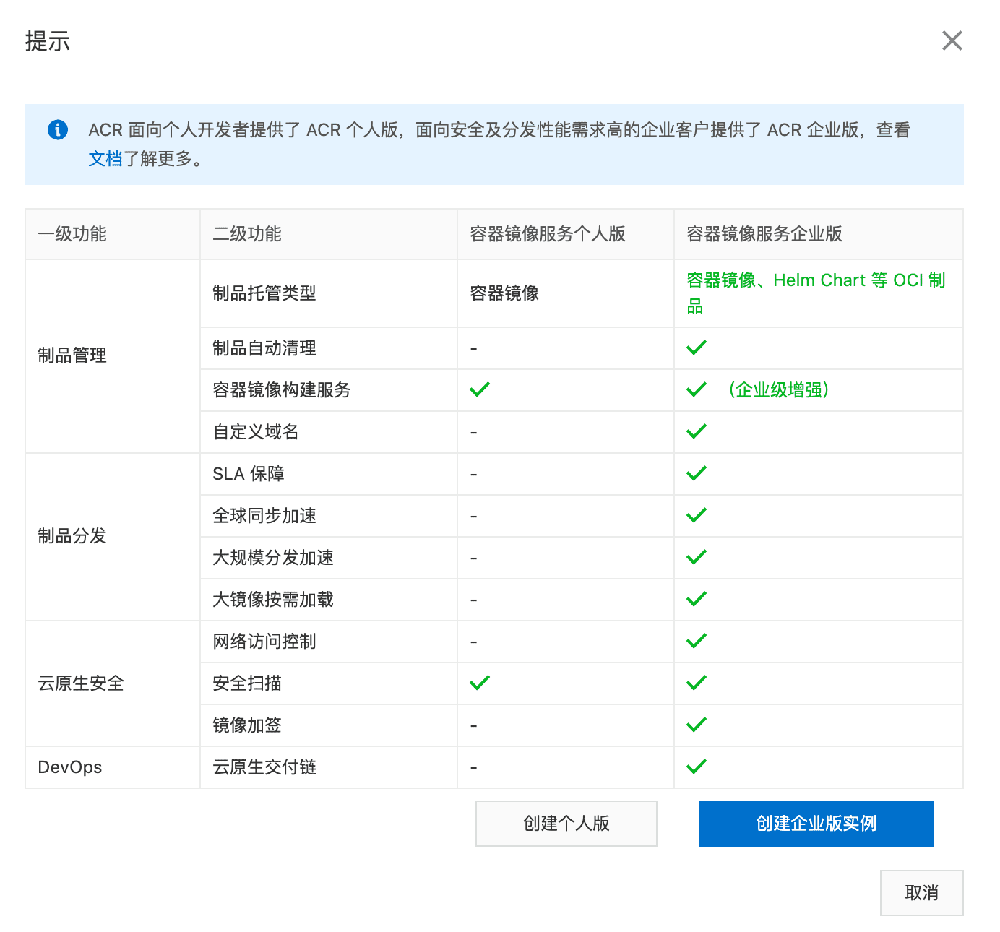

## 容器的镜像服务

|                  |              |                    |                                  |
| :--------------- | :----------- | :----------------- | :------------------------------- |
| 一级功能         | 二级功能     | 容器镜像服务个人版 | 容器镜像服务企业版               |
| 制品管理         | 制品托管类型 | 容器镜像           | 容器镜像、Helm Chart 等 OCI 制品 |
| 制品自动清理     | -            |                    |                                  |
| 容器镜像构建服务 |              | （企业级增强）     |                                  |
| 自定义域名       | -            |                    |                                  |
| 制品分发         | SLA 保障     | -                  |                                  |
| 全球同步加速     | -            |                    |                                  |
| 大规模分发加速   | -            |                    |                                  |
| 大镜像按需加载   | -            |                    |                                  |
| 云原生安全       | 网络访问控制 | -                  |                                  |
| 安全扫描         |              |                    |                                  |
| 镜像加签         | -            |                    |                                  |
| DevOps           | 云原生交付链 | -                  |                                  |

## 容器镜像服务（Container Registry）
- 提供多地域镜像托管能力，稳定的国内外镜像构建服务，便捷的镜像授权功能，方便用户进行镜像全生命周期管理。在开通流程中，您需要设置独立于账号密码的Registry登录密码，便于镜像的上传、下载。

## register :  帐号:阿里云账户全名   密码: authPass:ali容器镜像服务

