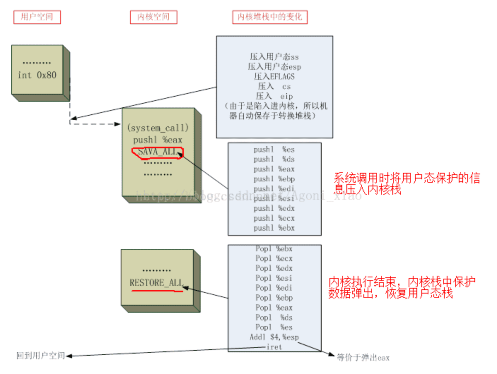

因为`用户态`和`内核态`不共用一个堆栈，所以用户态调用系统调用时，得先保存用户态的信息到寄存器，然后切入到内核态，将寄存器中的信息拷贝到内核栈开始执行，执行结束后，还原之前用户态的状态让用户态继续往下执行。

用户态程序通过ebx,ecx,edx等寄存器，传递函数参数给系统调用，ebx,ecx,edx等寄存器通过SAVE_ALL宏压到内核栈。

系统调用结束之后，RESTORE_ALL宏把SAVE_ALL宏压入的寄存器反向弹出，以用于恢复现场。





``` c

#include <sys/time.h>
#include <stdio.h>
#include <unistd.h>
void main(){
    struct timeval start, end;
    long mtime, seconds, useconds;

    gettimeofday(&start, NULL);
    //usleep(2000);
    int i;
    for(i=0;i<10000000;i++){
    //sleep(5);
        getpid();
    }

    gettimeofday(&end, NULL);

    seconds  = end.tv_sec  - start.tv_sec;
    useconds = end.tv_usec - start.tv_usec;

    mtime = ((seconds) * 1000 + useconds/1000.0) + 0.5;
    printf("Elapsed time: %ld milliseconds\n", mtime);

    printf("init tgid=%d\n",getpid());
    printf("init gid=%d\n",gettid());
    printf("init pgid=%d\n",getpgid(getpid()));
}
```
* 跟踪系统调用
``` bash
Elapsed time: 7526 milliseconds
init tgid=21388
init gid=21388
init pgid=21388
hfb@hfb:~/c$ gcc syscall_loop.c 
sudo strace -p 21487
getpid()                                = 21487
clock_nanosleep(CLOCK_REALTIME, 0, {tv_sec=5, tv_nsec=0}, 0x7ffff8a732d0) = 0
```

# 结论 `虚拟机互环境下` 系统调用消耗大
10M(1000万)次系统调用,花费了8秒钟


``` c
#include <sys/time.h>
#include <stdio.h>
#include <unistd.h>


int fun1(int num){
        return 1;
}
int fun2(int num){
        return 2;
}
int fun3(int num){
        return 3;
}
int fun4(int num){
        return 4;
}
int fun5(int num){
        return 5;
}

void main(){

    struct timeval start, end;
    long mtime, seconds, useconds;
    gettimeofday(&start, NULL);
    //usleep(2000);
    int i;
    for(i=0;i<10000000;i++){
        fun1(1);
        fun2(1);
        fun3(1);
        fun4(1);
        fun5(1);
    }

    gettimeofday(&end, NULL);

    seconds  = end.tv_sec  - start.tv_sec;
    useconds = end.tv_usec - start.tv_usec;

    mtime = ((seconds) * 1000 + useconds/1000.0) + 0.5;
    printf("Elapsed time: %ld milliseconds\n", mtime);

    printf("init tgid=%d\n",getpid());
    printf("init gid=%d\n",gettid());
    printf("init pgid=%d\n",getpgid(getpid()));
}
```


`0.12秒,完成了50M(5000万)次函数调用`

``` bash
Elapsed time: 117 milliseconds
init tgid=21697
init gid=21697
init pgid=21697
```


[原文链接](https://blog.csdn.net/Agoni_xiao/article/details/79034290)


