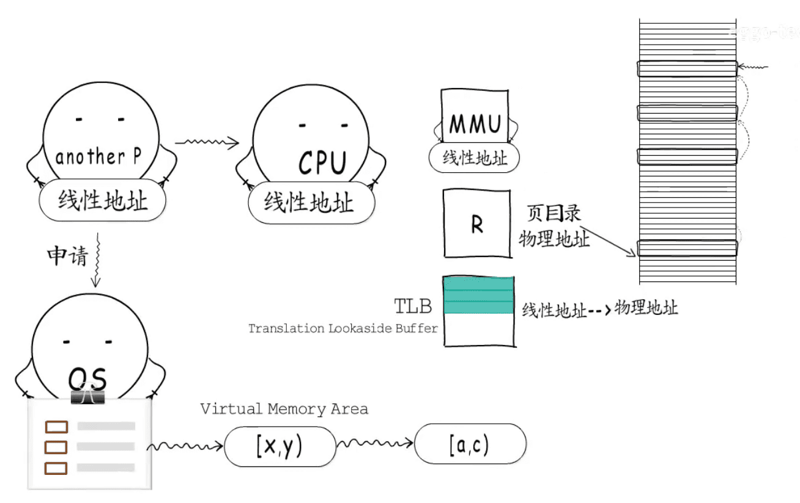

## 进程切换分两步
* 1.切换页目录以使用新的地址空间
* 2.切换内核栈和硬件上下文。

* 对于linux来说，线程和进程的最大区别就在于地址空间。
* 对于线程切换，第1步是不需要做的，第2是进程和线程切换都要做的。 所以明显是进程切换代价大

线程上下文切换和进程上下文切换一个最主要的区别是线程的切换虚拟内存空间依然是相同的，但是进程切换是不同的。这两种上下文切换的处理都是通过操作系统内核来完成的。内核的这种切换过程伴随的最显著的性能损耗是将寄存器中的内容切换出。

另外一个隐藏的损耗是上下文的切换会扰乱处理器的缓存机制。简单的说，一旦去切换上下文，处理器中所有已经缓存的内存地址一瞬间都作废了。`还有一个显著的区别`是当你改变`虚拟内存空间`的时候，处理的`页表缓冲`（processor’s Translation Lookaside Buffer (TLB)）或者相当的神马东西会被全部刷新，这将导致内存的访问在一段时间内相当的低效。`但是在线程的切换中，不会出现这个问题`

[图片来源:tlb是什么东西](https://www.bilibili.com/video/BV1KD4y1U7Rr)

