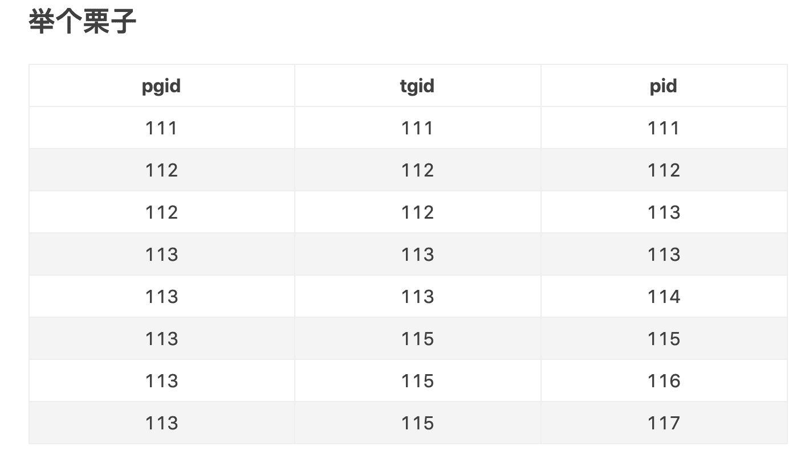

## linux中的进程与线程
* 进程是资源分配的基本单位
* 线程是CPU调度的基本单位
* 一个进程下可能有多个线程
* 线程共享进程的资源


linux用户态的进程、线程基本满足上述概念，但内核态不区分进程和线程。可以认为，内核中`统一执行的是进程`，但有些是“普通进程”（对应进程`process`），有些是“轻量级进程”（对应线程`pthread`或npthread），`都使用task_struct结构体`保存保存。


## 进程是资源分配的基本单位、线程共享进程的资源
普通进程需要`深拷贝`虚拟内存、文件描述符、信号处理等；而轻量级进程之所以“轻量”，是因为其只需要`浅拷贝`虚拟内存等大部分信息，多个轻量级进程共享一个进程的资源。


## 线程是CPU调度的基本单位、一个进程下可能有多个线程
* 操作系统中存在多个进程组
* 一个进程组下有多个进程（1:n）
* 一个进程对应一个线程组（1:1）
* 一个线程组下有多个线程（1:n）

`task_struct`中，使用pgid标的进程组，tgid标的线程组，pid标的进程或线程。假设目前有一个进程组，则上述概念对应如下：

* 进程组中有一个主进程（父进程），pid等于进程组的pgid；进程组下的其他进程都是父进程的子进程，pid不等于pgid
* 每个进程对应一个线程组，pid等于tgid。
* 线程组中有一个“主线程”（勉强称为“主线程”，位的是与主进程对应；语义上绝不能称为“父线程”），pid等于该线程组的tgid；`线程组下的其他线程都是与主线程平级`，pid不等于tgid

因此，调用getpgid返回pgid，调用getpid应返回tgid，调用gettid应返回pid。使用的时候不要糊涂。
进程下除主线程外的其他线程是CPU调度的基本单位，这很好理解。而所谓主线程与所属进程实际上是同一个task_struct，也能被CPU调度，因此主线程也是CPU调度的基本单位。

`tgid相同的所有线程组成了概念上的“进程”`，只有`主线程在创建时会实际分配资源`，其他线程通过浅拷贝共享主线程的资源。结合前面介绍的普通线程与轻量级进程，实现“进程是资源分配的基本单位”。





## 存在3个进程组111、112、113
* 进程组111下有1个父进程111，单独分配资源
* 进程111下有1个线程111，共享进程111的资源
* 进程组112下有1个父进程112，单独分配资源
* 进程112下有2个线程112、113，共享进程112的资源
* 进程组113下有1个父进程113，1个子进程115，各自单独分配资源
* 进程113下有2个线程113、114，共享进程113的资源
* 进程115下有3个线程115、116、117，共享进程115的资源


# 小结
* 进程是一个逻辑上的概念，用于管理资源，对应`task_struct`中的资源
* 每个进程至少有一个线程，用于具体的执行，对应`task_struct`中的任务调度信息
* 以`task_struct`中的pid区分线程，tgid区分进程，pgid区分进程组


``` c
#include <unistd.h>
#include <stdio.h>

void main(){
        printf("init tgid=%d\n",getpid());
        printf("init gid=%d\n",gettid());
        printf("init pgid=%d\n",getpgid(getpid()));
}
```


[原文链接](https://www.jianshu.com/p/023e55f878a7)


