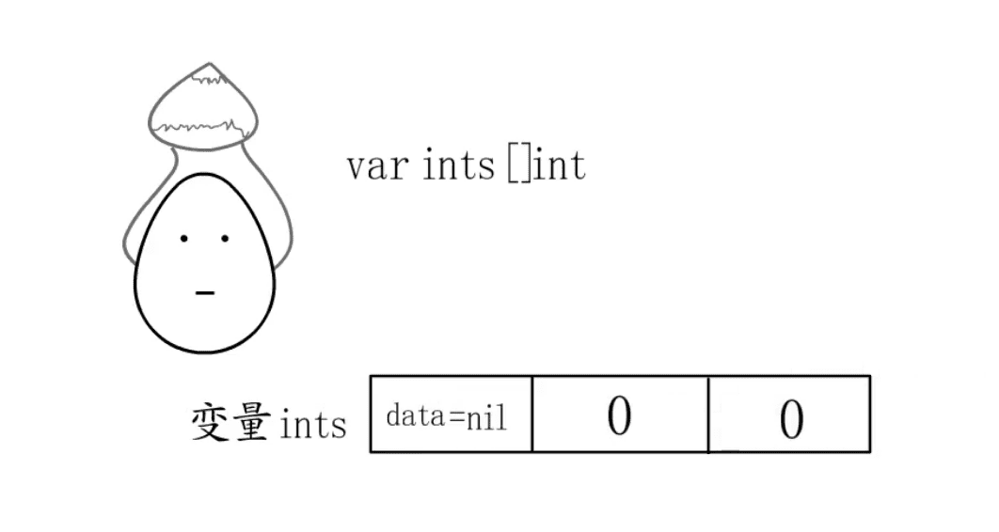
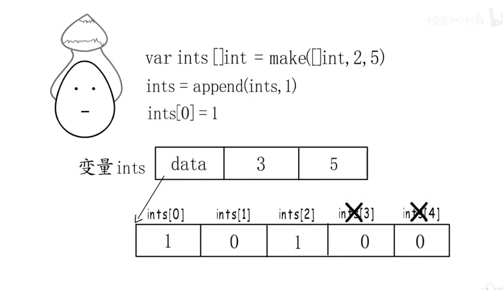
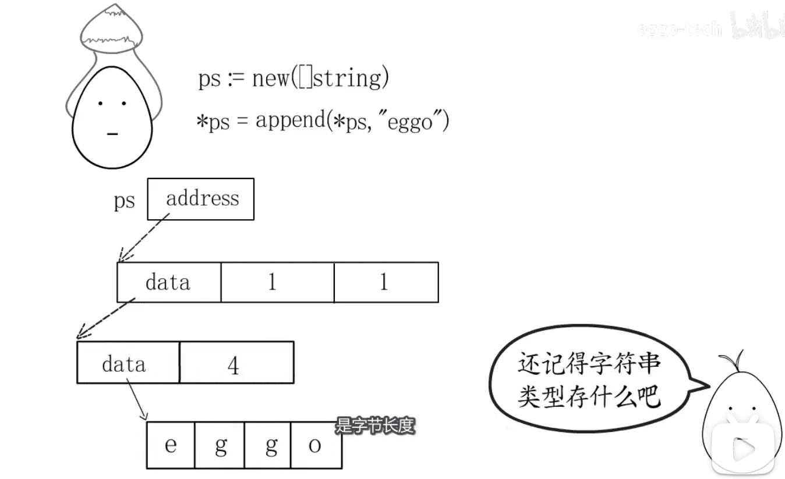
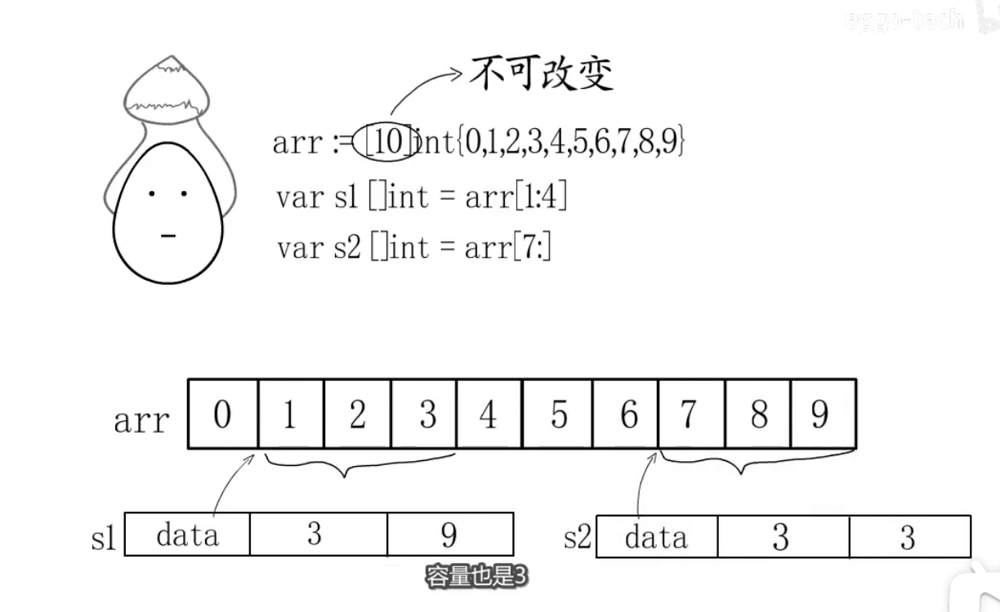
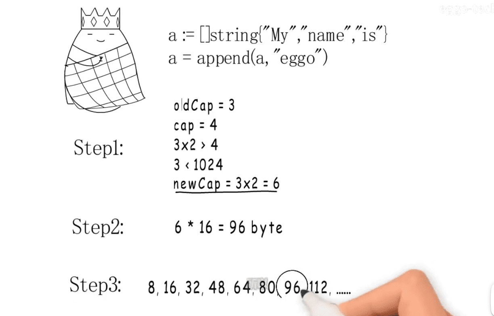

直接看图:

* make 和 new 的 区别
* 在[10]int 中 赋值给slice 后内存状态
* 数组=>slice=>在slice上的append操作,引用了什么底层数组
* 扩容规则












# 扩容规则




* 内存管理模块

  


[图片来源视频](https://www.bilibili.com/video/BV1CV411d7W8)


* 从gin request中读取所有数据: ioutil.ReadAll(c.Request.Body)
  * golang 数据结构slice ioutil.ReadAll(c.Request.Body) 

``` golang
func ReadAll(r Reader) ([]byte, error) {
	b := make([]byte, 0, 512)
	for {
		if len(b) == cap(b) {
			// Add more capacity (let append pick how much).
			b = append(b, 0)[:len(b)]
		}
		n, err := r.Read(b[len(b):cap(b)])
		b = b[:len(b)+n]
		if err != nil {
			if err == EOF {
				err = nil
			}
			return b, err
		}
	}
}
```
