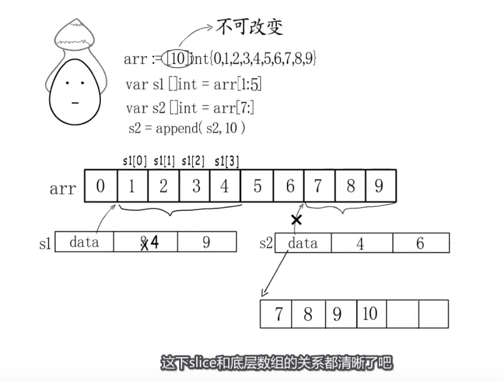

## make 和 new 的 区别
  - https://blog.csdn.net/nyist_zxp/article/details/111567784
    - make 是 Golang 的内建函数，仅用于分配和初始化 slice、map 以及 channel 类型的对象，三种类型都是结构。返回值为类型，而不是指针。
  - 1,new 和 make 都用于分配内存
  - 2,new 和 make 都是在堆上分配内存
  - 3,new 对指针类型分配内存,返回值是分配类型的指针,new不能直接对slice,map,channel分配内存
  - 4,make 仅用于slice,map,channel的初始化,返回值为类型本身,而不是指针

- 在[10]int 中 赋值给slice 后内存状态
- 数组=>slice=>在slice上的append操作,引用了什么底层数组
- 扩容规则


## make() 是 Go 语言内存分配的内置函数，默认有三个参数。
- make(Type, len, cap)
- Type：数据类型，必要参数，Type 的值只能是 slice、 map、 channel 这三种数据类型。
- len：数据类型实际占用的内存空间长度，map、 channel 是可选参数，slice 是必要参数。
- cap：为数据类型提前预留的内存空间长度，可选参数。所谓的提前预留是当前为数据类型申请内存空间的时候，提前申请好额外的内存空间，这样可以避免二次分配内存带来的开销，大大提高程序的性能。





# 扩容规则


- 内存管理模块

  


[图片来源视频](https://www.bilibili.com/video/BV1CV411d7W8)


- 从gin request中读取所有数据: ioutil.ReadAll(c.Request.Body)
  - golang 数据结构slice ioutil.ReadAll(c.Request.Body) 

``` golang
func ReadAll(r Reader) ([]byte, error) {
	b := make([]byte, 0, 512)
	for {
		if len(b) == cap(b) {
			// Add more capacity (let append pick how much).
			b = append(b, 0)[:len(b)]
		}
		n, err := r.Read(b[len(b):cap(b)])
		b = b[:len(b)+n]
		if err != nil {
			if err == EOF {
				err = nil
			}
			return b, err
		}
	}
}
```
