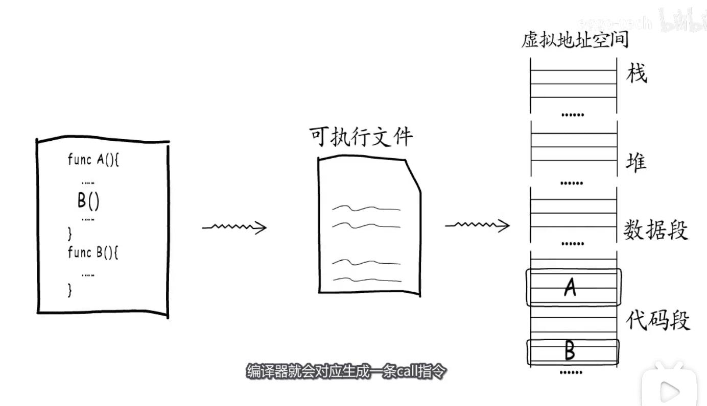
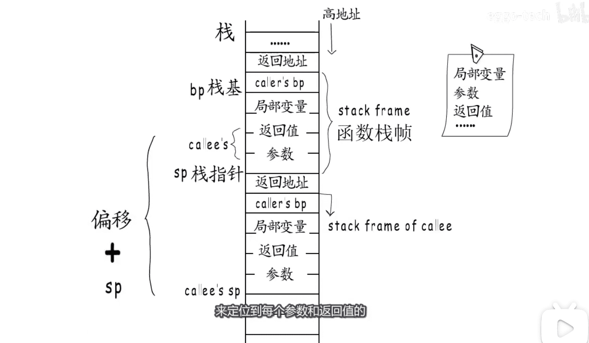
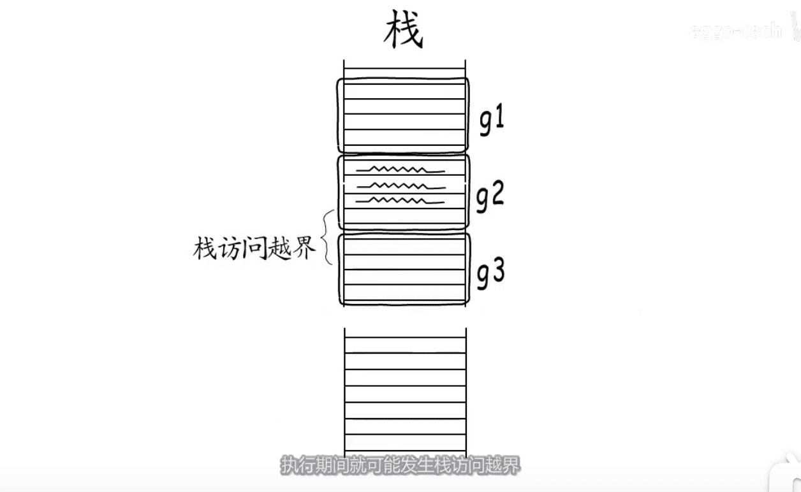
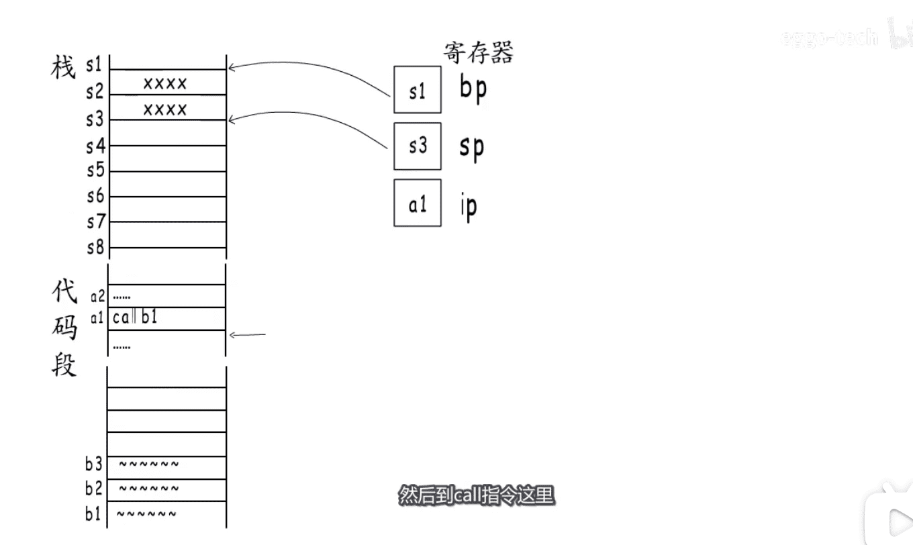
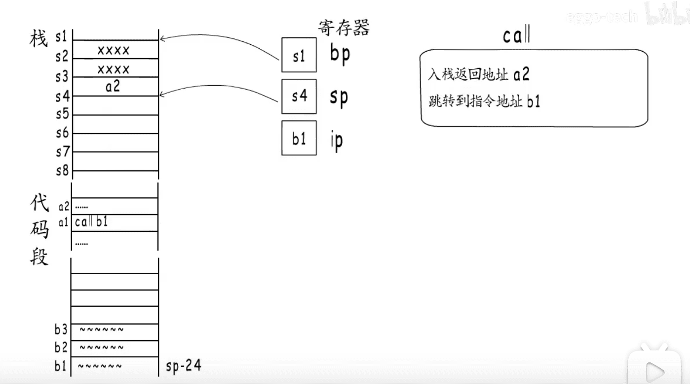
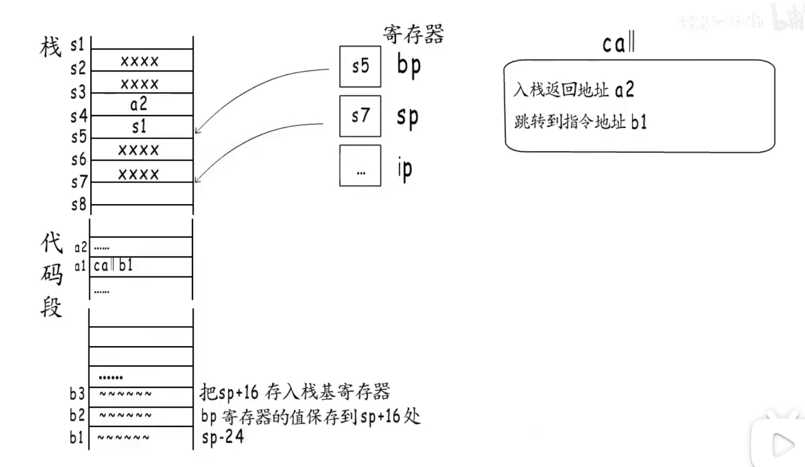
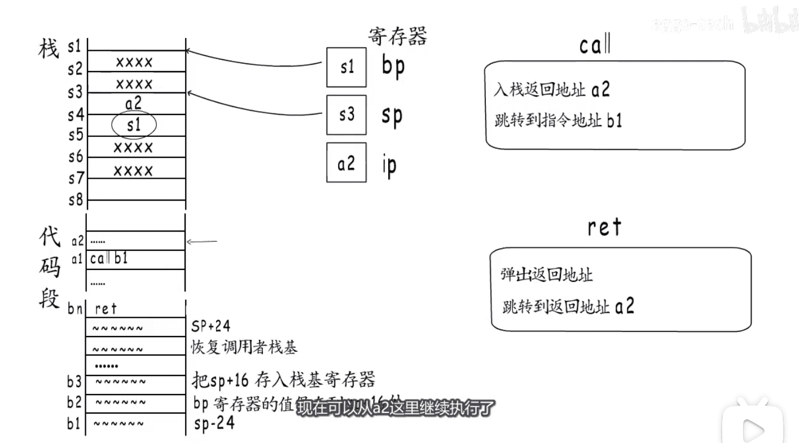

# 编译器 函数 -> 可执行文件
* 虚拟地址空间 `栈` `堆` `数据段` `代码段`
* 栈: `栈基bp` `栈指针sp` `高地址->低地址` 
* 栈:局部变量,参数,返回值
* go  的栈访问越界与迁移  `函数头部检测栈栈增长(是否够用)代码` 
* go call ret 实现函数跳转与返回

* go的栈访问越界与迁移  `函数头部检测代码` 

  

* go call ret 实现函数跳转与返回

* 步骤1: 函数执行到a1
* 
* 步骤2: callb1指令发生了哪些变化  `入栈返回地址->sp`  `跳转新的代码段执行->ip`
*  
* 步骤3: 编译器在`函数开头`插入的指令 b1 b2 b3
* 
* 步骤4: 编译器在`函数结尾` 插入的指令
* 

[图片来源视频](https://www.bilibili.com/video/BV1WZ4y1p7JT)

