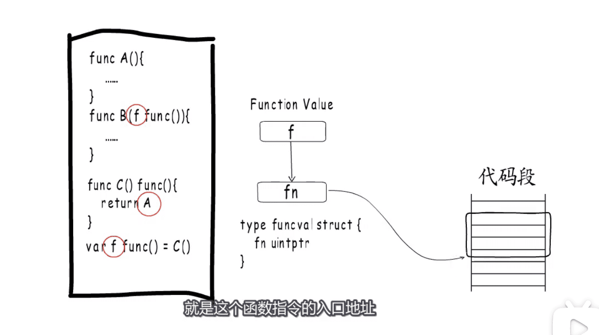
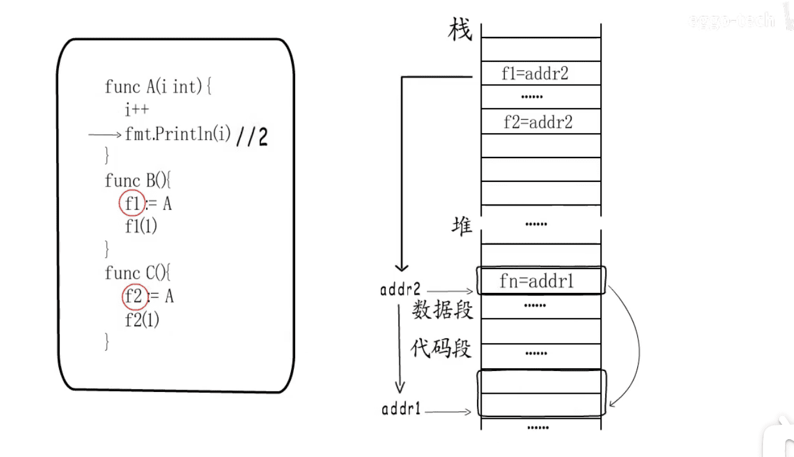
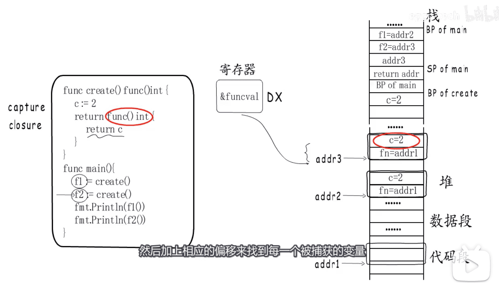
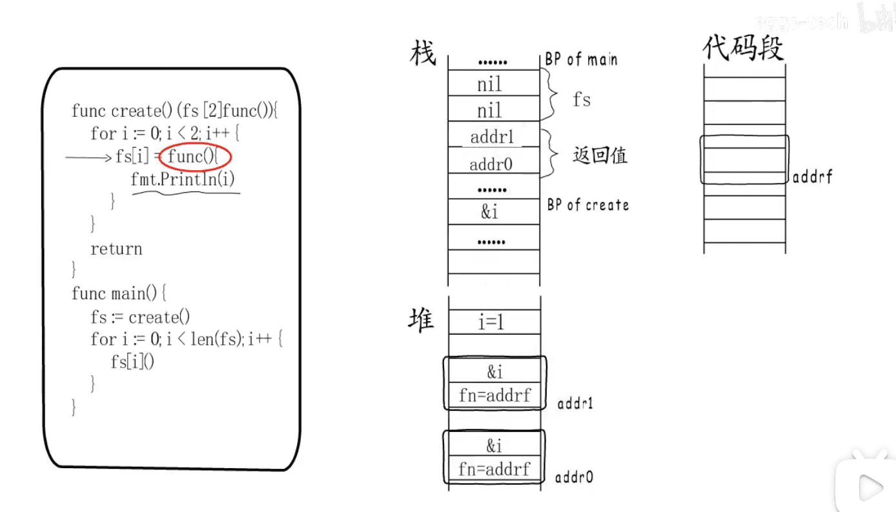
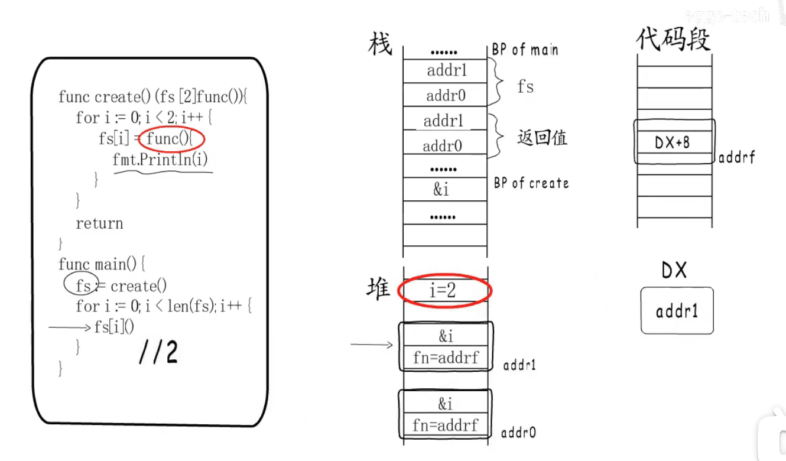
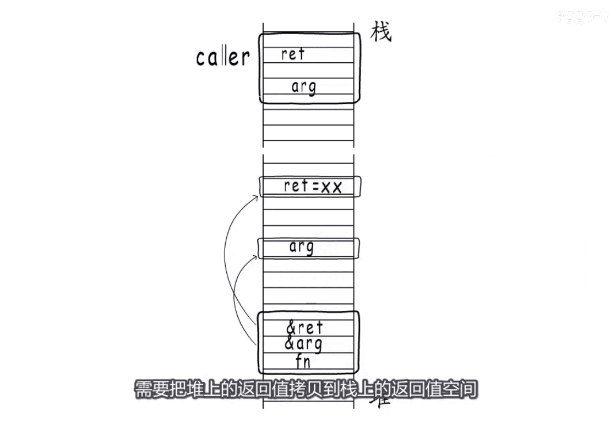

* go中是头等对象
* 

* 

* 为什么要倒一下手  在`数据段对象` 再指向 `代码段`
* 
* 闭包的变量的另一种情况 的栈表现
* 

* 返回的闭包函数在外面调用 `局部变量的堆分配` `变量逃逸`
* 

* 当有变量和返回值时 `保持捕获变量在外层函数` `闭包函数` 的`一致性`
* 闭包使用的是`堆中的变量` 返回时 需要把堆中的变量拷贝到栈中
* 

[图片来源视频](https://www.bilibili.com/video/BV1ma4y1e7R5)

