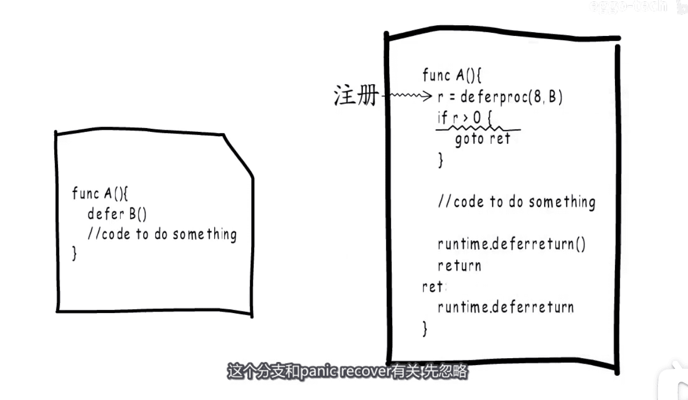
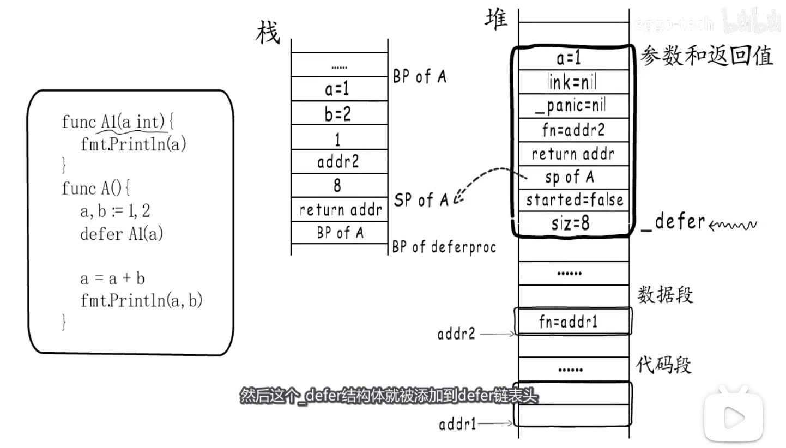
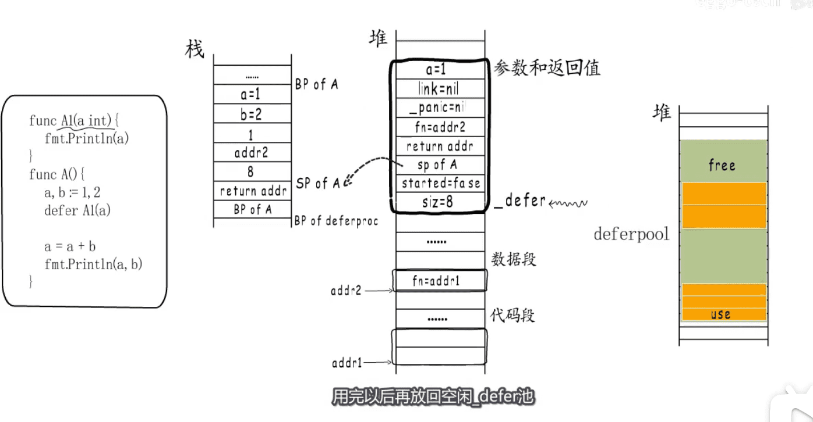
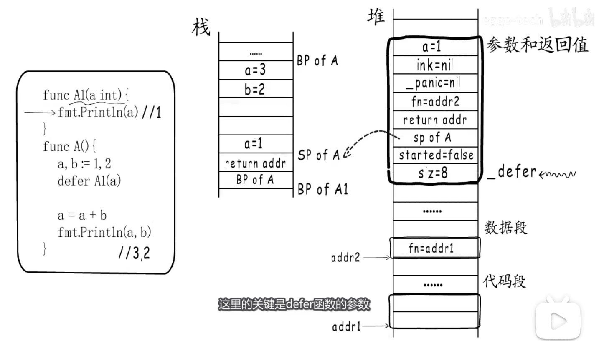
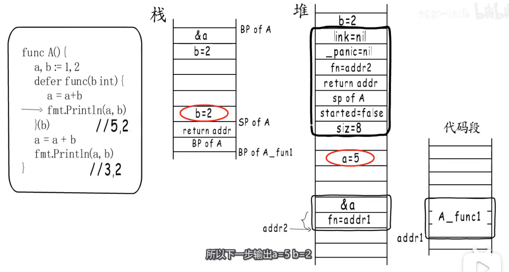
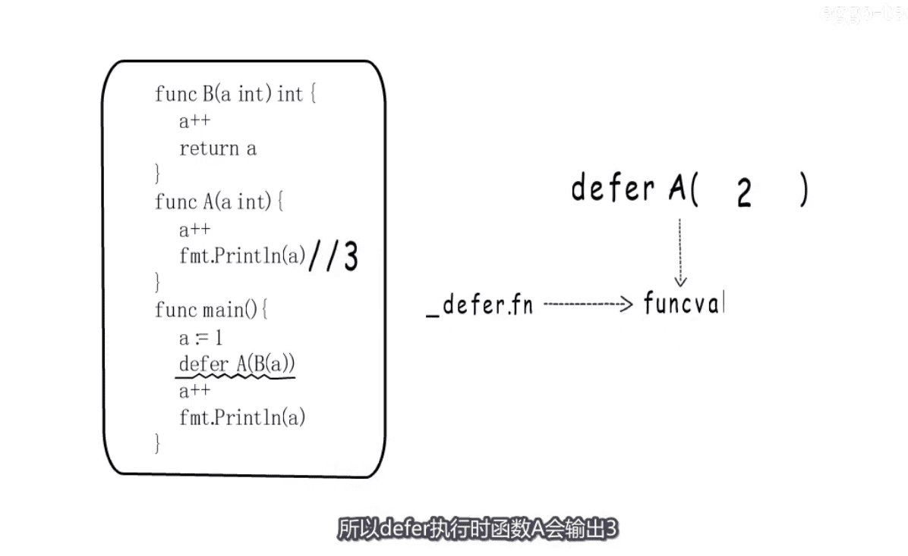
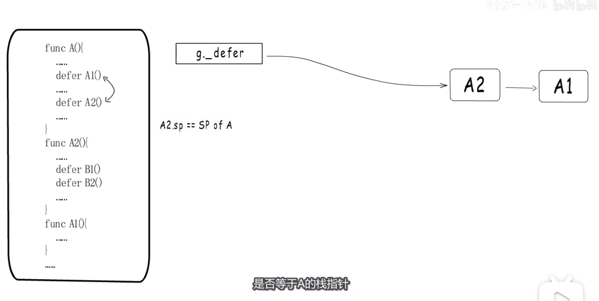
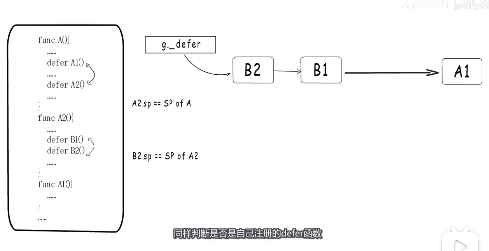

* defer 编译后的伪指令如下
* 

* go 协程 实现机制原理 里有一个defer链表头
* 

* defer结构体字段说明
* 

* defer 函数 形成的 栈 和 堆 情况
* 

* defer内存池,, deferproc函数后的 堆 栈状态
* 

* 留意defer函数的参数
* 

* defer 传参 和 闭包捕获 变量的实现机制
* 

* defer的一个写法,要知道干了啥
* 

* 协程里,,不同函数调用产生多个defer的动作,如果判断defer归当前函数
*  

* 彩蛋  `堆分配`   1.12版本defer问题  `参数在栈和堆间来回拷贝`  `链接慢`
* 

[图片来源视频](https://www.bilibili.com/video/BV1E5411x7NC)