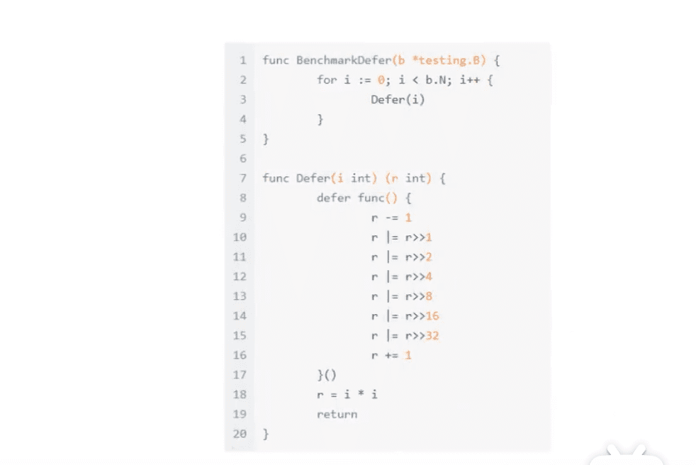

* 1.12  和 1.13 编译后的伪指令比较
* 

* 1.13减少堆分配  `以下两种代码情形还是会在list中`
* 

* 1.13中defer结构体增加了标识是否堆分配
* 

* 1.14做出的优化 一些情况下免于创建defer结构体  代价 panic时 `栈扫描`
* 编译的伪代码形式如下  `免注册链表`
* 

* 版本间的性能测试  一个数量级 
* 

* 

* 1.14 栈扫描 666
* 

[图片来源视频](https://www.bilibili.com/video/BV1b5411W7ih)