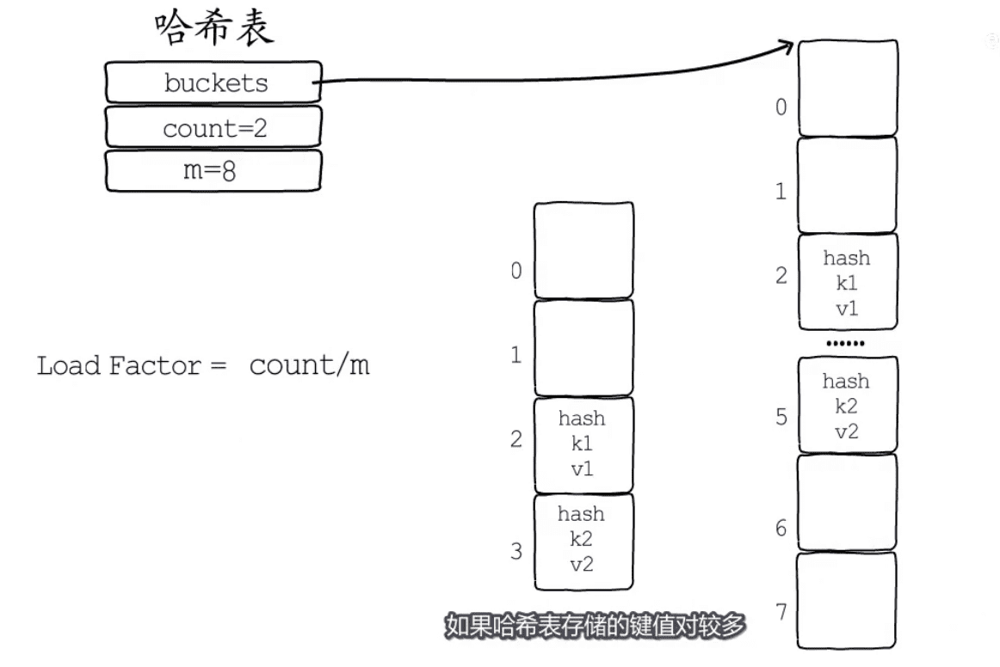
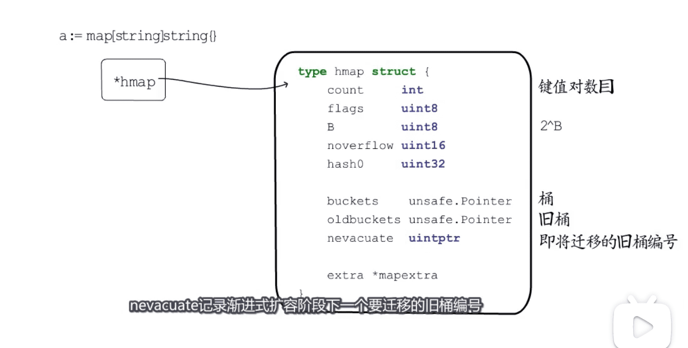
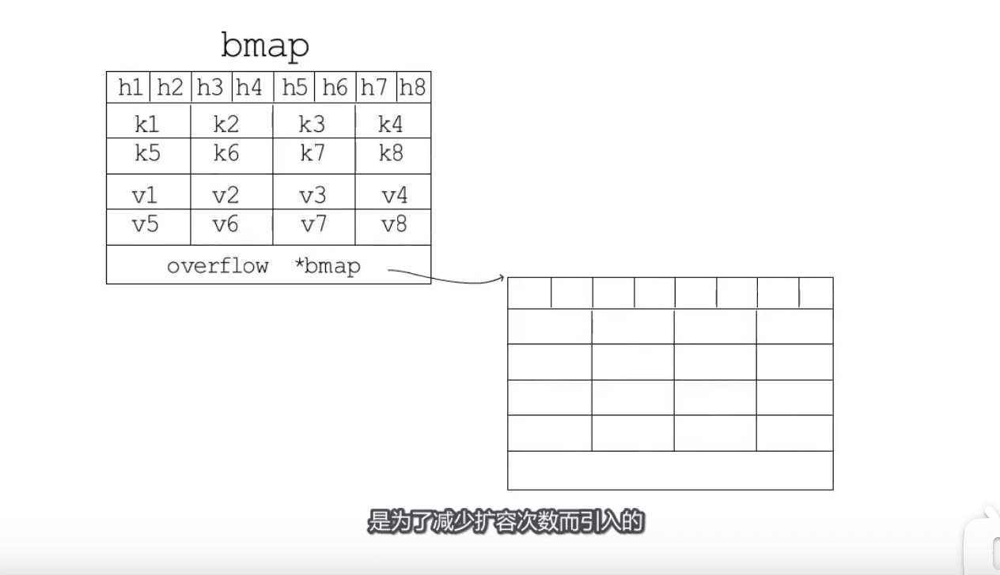
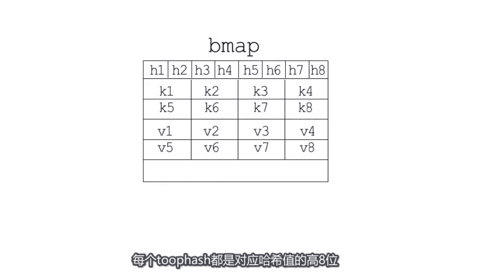
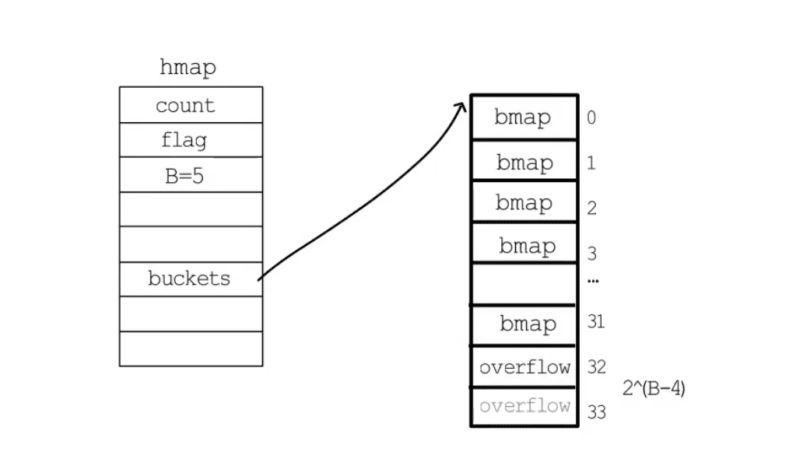
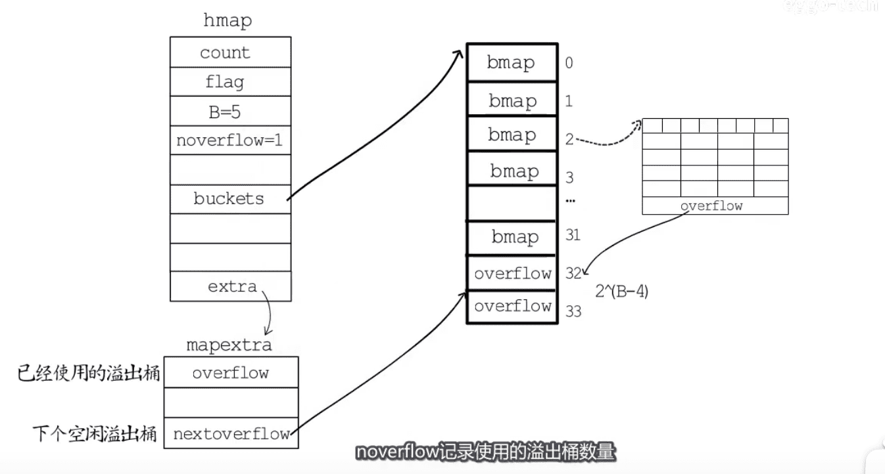
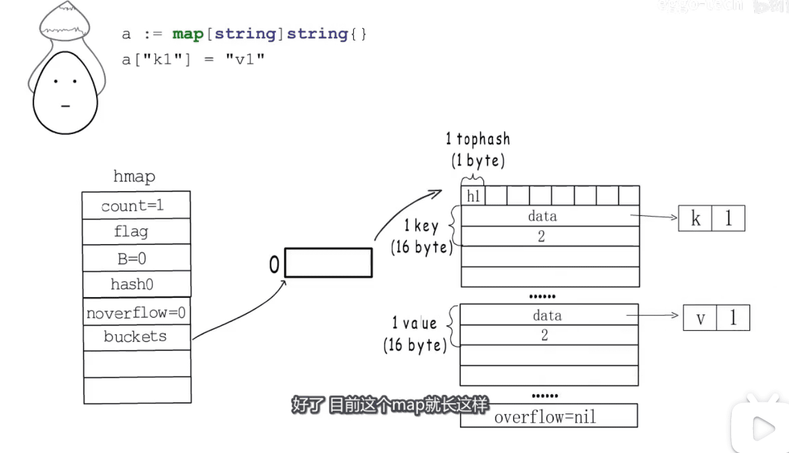

哈希表
* 取模法
* 与运算

冲突解决  
* 开放地址法
* 拉链法  

扩容  `负载因子`
* 渐进式扩容 `性能瞬时抖动` 
* 

* map在内存中的表现

* 
* map使用的桶长什么样子 bmap结构 

* 

* h1...h8 对应hash值的高8位

* 

* hmap 与 bmap的关系
* 

* 使用一段时间后结构变化
* 

* 代码到内存结构的映射
* 

* golang 扩容规则
* 

