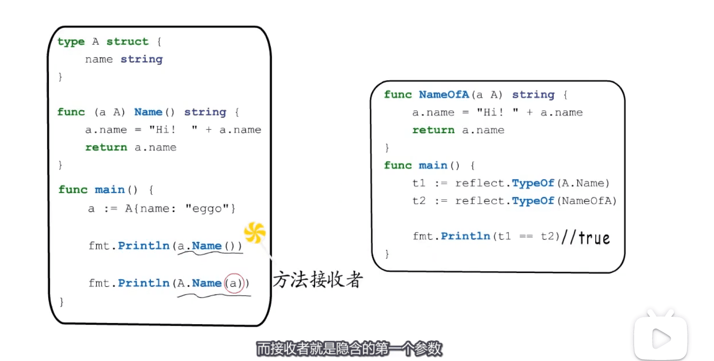
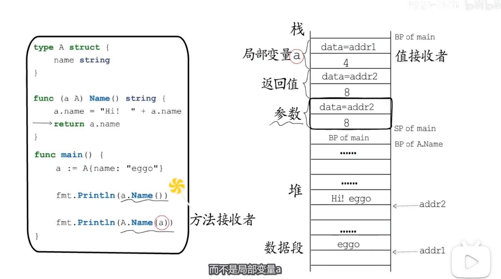
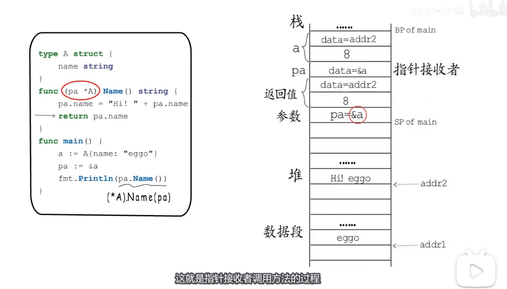
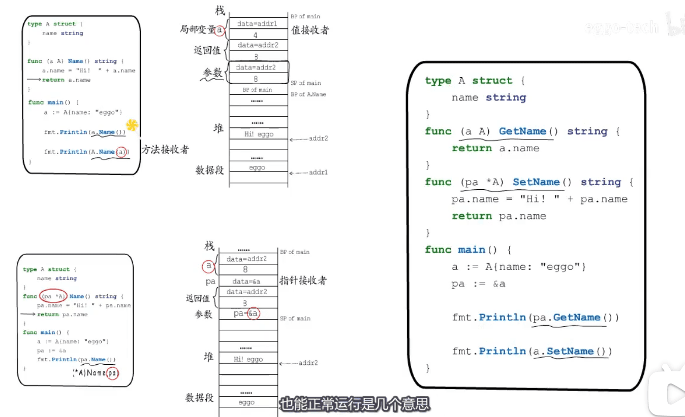
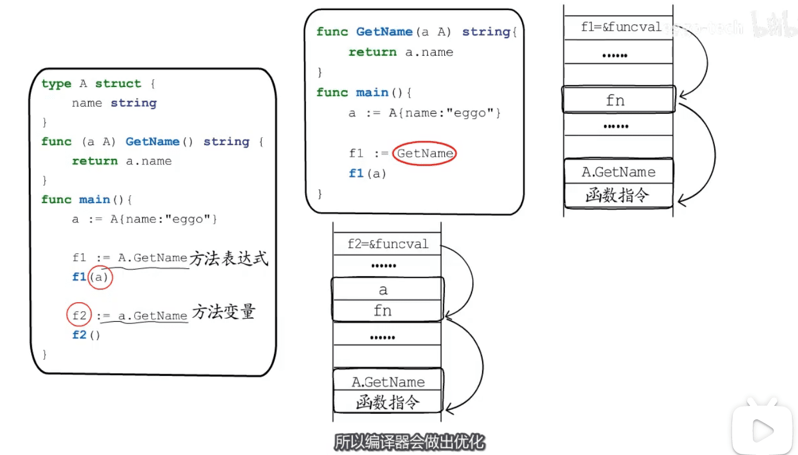
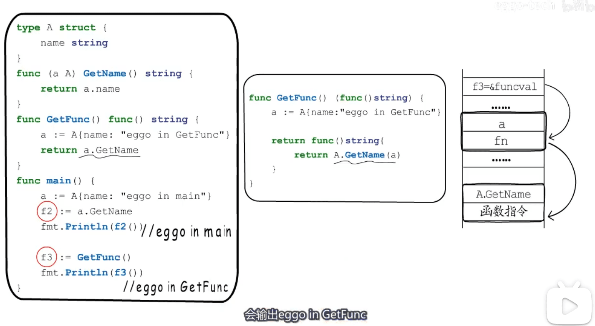

* 语法糖 参数捕获 
* 

* 传参值拷贝 `这样的写法改不到外层的string`
* 
* 通过指针,让函数修改外部变量
* 

* 语法糖的隐藏转换  `值调用指针接收者方法`  `指针调用值接收者方法`
* 

* 闭包:有捕获列表的function Value
* `方法表达式` `方法变量`
* 

* 另一个例子
* 

[图片来源视频](https://www.bilibili.com/video/BV1Yt4y1Q7A5)

