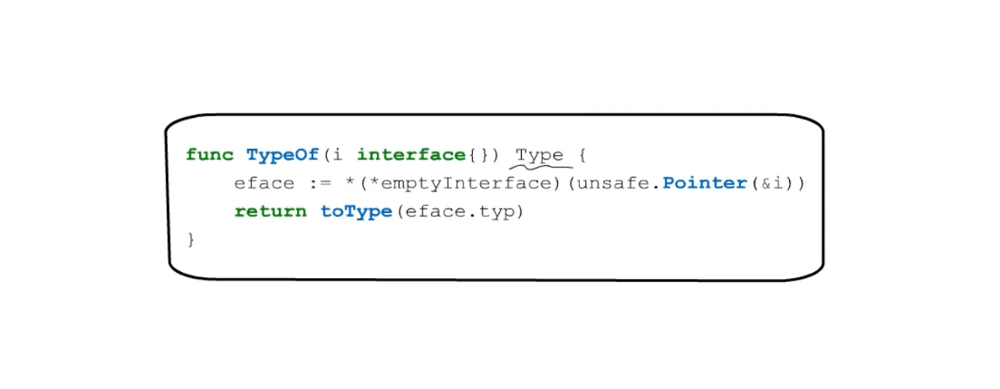
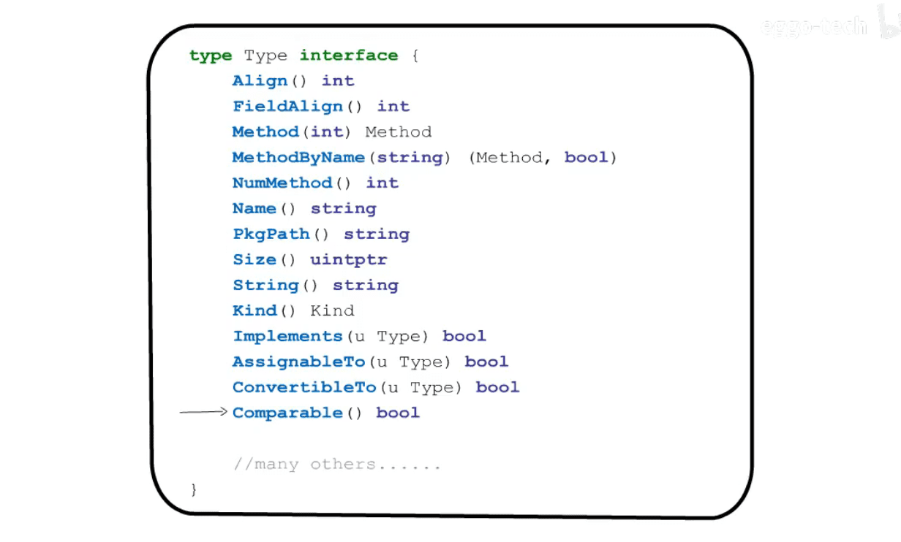
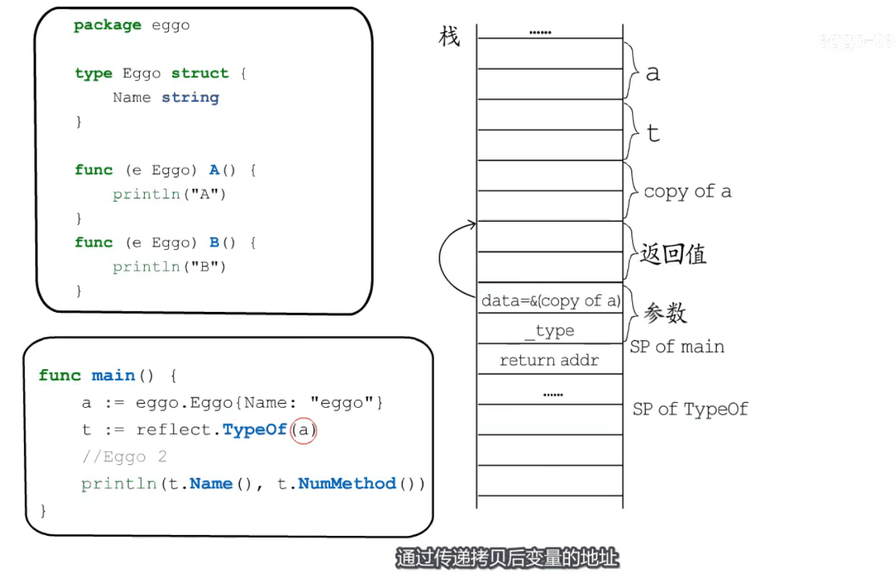
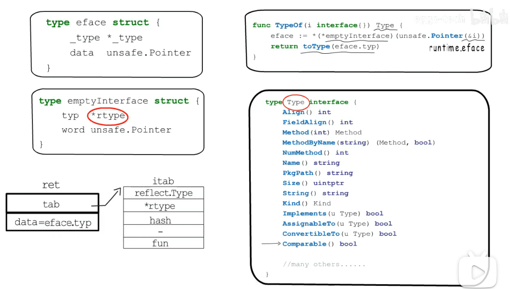
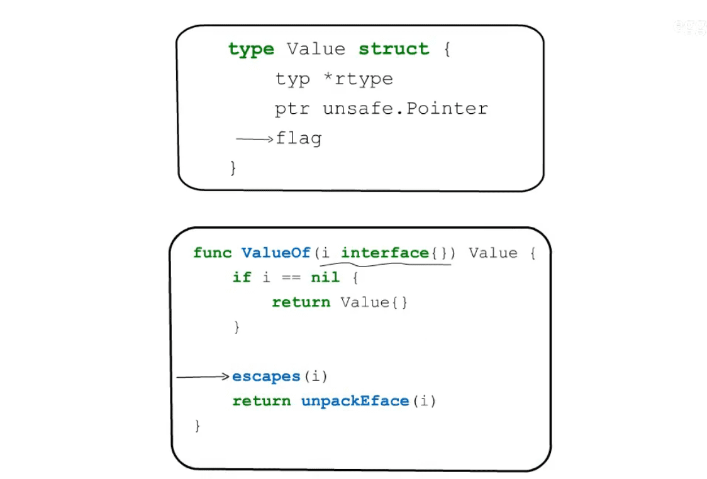
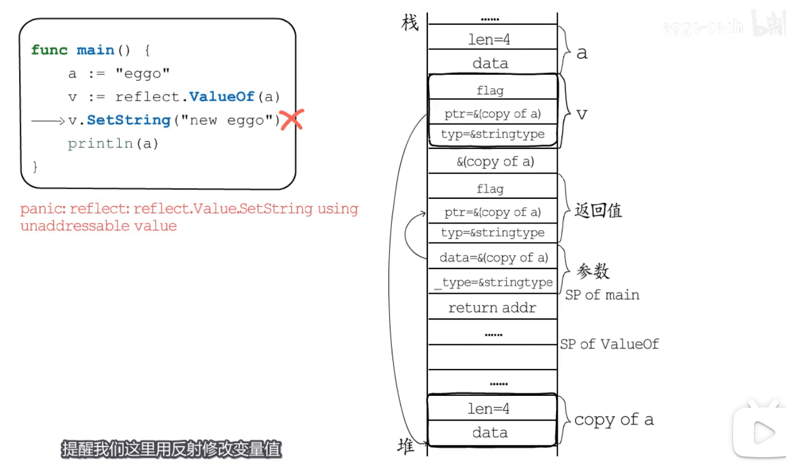
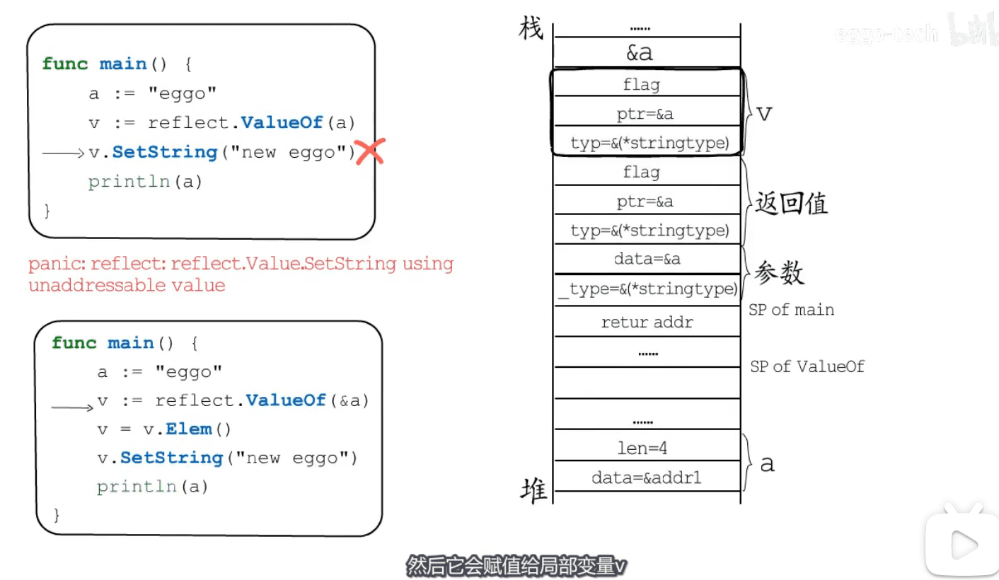
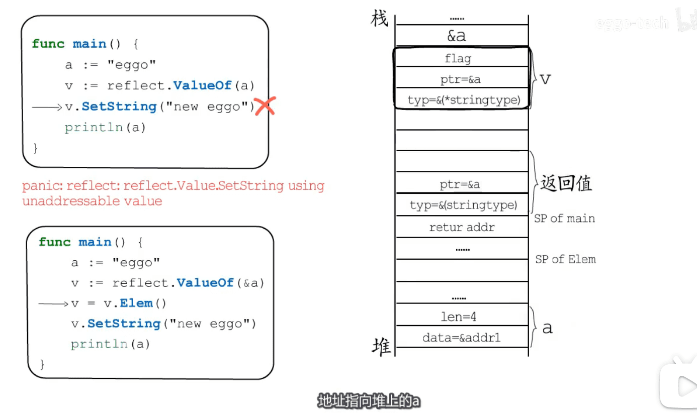

* 反射原理: 把`类型元数据` `暴露`  给接口使用
* 
* 

* reflect 通过传递拷贝后变量的地址实现 `值传递` 语义
* 
* 反射获取`类型信息` 
* 

* 反射修改具体的值,  用到的结构体
* 
* 反射修改变量值 panic 的一种情况
* 

* 反射修改变量值 `正确写法`

* 步骤1  reflect.ValueOf
* 

* 步骤2 v.Elem
* 

* 示例   /Users/hfb/projects/go/gopath/src_only_mod_copy/gopl.io/a_for_test/reflect/main_call_func.go
* 示例 /Users/hfb/projects/go/gopath/src_only_mod_copy/gopl.io/a_for_test/reflect/main_change_string.go

[图片来源视频](https://www.bilibili.com/video/BV1WZ4y1M7r1)
