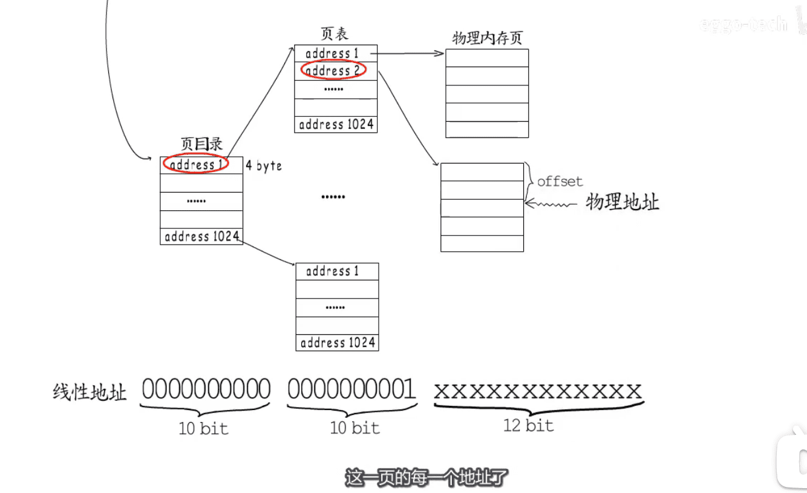

* 单片机(早期程序)
* 

* 进化后虚拟内存

* 

* 页目录(1024页表  *  二级1024*  * 4k = 4G)

* 

* 进程地址空间的隔离
* 

* 进程间共享内存
* 

* 页表页有12位可以使用  `标识`  `可读` `可写` `可执行`  `是否映射` 等信息
* 

* 

* vma链表  `已申请但未映射的状态`
* 进程切换,需要清TLB  `cpu缓存`
*  

[图片来源视频](https://www.bilibili.com/video/BV1KD4y1U7Rr)

